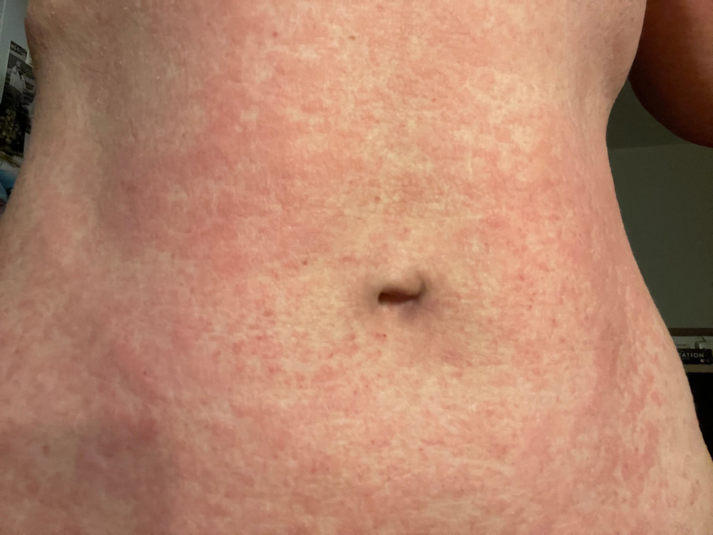
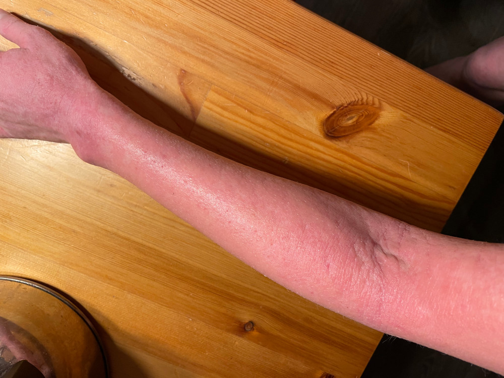

## Začínám s autoimunitním protokolem!



Odmala trpím atopickým ekzémem, který se striktně vzato, mezi autoimunity neřadí, ale imunitní systém v něm hraje velkou roli. V průběhu života jsem měla vždy horší a lepší období, co se týče kůže, ale asi nejvíc se to zvrtlo s mým prvním těhotenstvím, kdy jsem skončila na systémových kortikoidech a užívala jsem je celé 3 roky. Bez nich jsem nebyla schopná normálně fungovat, vždy, když jsem zkusila snížit dávku, tak se mi kůže rozjela. Někdy jsem musela dokonce trochu přidat, protože jsem se probudila třeba takhle:

## Nežádoucí účinky kortikoidů
Kortikoidy mi vždycky pomohly, ale mají spoustu nežádoucích účinků. U mě se to projevilo tak, že již ve svých 30ti letech mám v bederní páteři osteoporózu. Když jsem to zjistila, tak jsem se rozhodla, že se kortikoidů zbavím a začala jsem hledat cestu. Tak jsem se dostala k autoimunitnímu protokolu.

## Co je to autoimunitní protokol
Autoimunitní protokol (AIP) je souhrn opatření, která mají za úkol zahojit propustné střevo, snížit aktivitu imunitního systému a zlepšit projevy autoimunitního onemocnění. Předpoklad je, že dieta obsahuje pouze takové potraviny, které jsou přirozeně málo alergizující a podporují střevní mikrobiom a střevní bariéru. Střevo je totiž místem, kde se nachází zhruba 70% všech imunitních buněk lidského těla a taky přes 100 bilionů střevních bakterií. Ty spolu navzájem spolupracují a vytváří spolu se střevními buňkami střevní bariéru. Problém nastává tehdy, když je nějakým způsobem bariéra porušená. Dochází k nadměrné aktivaci imunitního systému a rozvoji onemocnění. Tato situace se nazývá **leaky gut syndrom**, neboli **syndrom propustného střeva** a má spojitost s celou řadou chronických nemocí, nejenom těch autoimunitních. 

> Základem protokolu je striktní eliminační dieta, která se drží 4-6 týdnů, nejdéle 3 měsíce. 

| Povolené potraviny                           |  Zakázané potraviny |
| -------------------------------------------- | ------------------- |
| kvalitní maso a vnitřnosti                   | mouka a jiné obiloviny, rýže, sója |
| domácí masokostní vývary                     | mléčné výrobky |
| zelenina (kromě lilkovitých)                 | vejce |
| ovoce                                        | průmyslově zpracované potraviny, rafinované cukry |
| kvalitní tuky (olivový, kokosový, avokádo)   | semínka |
| fermentované výrobky                         | luštěniny |
| sůl                                          | lilkovitá zelenina (rajčata, papriky, lilek, brambory, chilli) | 
| bylinky                                      | ořechy |
| | bobulovité koření (pepř, nové koření, kmín...) |
| | káva, kakao |
| | alkohol |

## Co dál?
Po počáteční fázi se začínají přidávat postupně další potraviny a je nutné sledovat, zda se na ně neobjeví nějaká reakce. Cílem není dodržovat AIP celý život, ale postupně ten jídelníček obohatit. Pokud nově zavedená potravina nezhorší potíže, je možné ji bezpečně zařadit. AIP má nějaký standardní rámec, podle kterého se dodržuje včetně přidávání potravin. Ale! Nejdůležitější část toho je sledovat sám sebe, jak se člověk cítí, jak se vyvíjejí příznaky. Je to stejně jako s jakoukoliv jinou dietou, neexistuje jedna stejná dieta pro všechny a i AIP je možné si přizpůsobit. 

## Jak zjistím, že to funguje?
Existuje skupina lidí, šťastlivců, u kterých dojde k výraznému zlepšení potíží už během té eliminační fáze, dokonce jsou schopni snížit svoji dávku léků, které užívají. Pak jsou lidé, u kterých tělo potřebuje delší čas na vzpamatování se a výsledky se i přes velká očekávání ani po 3 měsících nedostaví. To může být demotivační, protože když vyvíjíte velkou snahu a nevidíte výsledky, tak to podkopává odhodlání snažit se dál. V tomhle případě je dobré se podívat na data, konkrétně na biomarkery. Většina autoimunitních onemocnění má svůj laboratorní ukazatel, podle kterého se hodnotí aktivita toho onemocnění. Stanovuje se hladina autoprotilátek a nespecifické zánětlivé parametry, jako např CRP nebo změny v krevním obraze. To je takový běžný základ, pokud chcete jít trochu hlouběji, je možné si nechat vyšetřit střevní mikrobiom, jeho složení, fungování střeva a jak velká je jeho propustnost. Já mám například střevo děravé jak cedník. Může se stát, že příznaky nepolevují, ale při dodržování těchto opatření se vaše biomarkery v těle začnou zlepšovat. Což je známka toho, že to, co děláte funguje a musíte prostě vytrvat i přes to, že vám třeba není líp. Že to teprve přijde. 
Pokud se ani po těch 3 měsících parametry nelepší, nejspíš děláte něco špatně. Buď jíte něco, co vám vadí, nebo jste podcenili ještě jednu neméně důležitou část AIP, a to je starání se o svoje wellbeing, tedy duševní pohodu. Vaše tělo se nemůže plně uzdravovat, pokud žijete v trvalém stresu, pokud máte nedostatek spánku, pohybu a kašlete na budování svých vztahů. Je mi jasné, že se to líp řekne, než udělá. Já si taky už dlouho namlouvám, že nemám čas cvičit. Ale kdybych měla být úplně upřímná, je to jen výmluva a kdybych chtěla, tak si ten čas najdu. 
A pokud byste měli pocit, že děláte všechno správně a stále to nepomáhá, tak je čas navštívit nějakého specialistu, protože v těle může být nějaký jiný problém, o kterém nevíte a který tomu uzdravení brání.  

