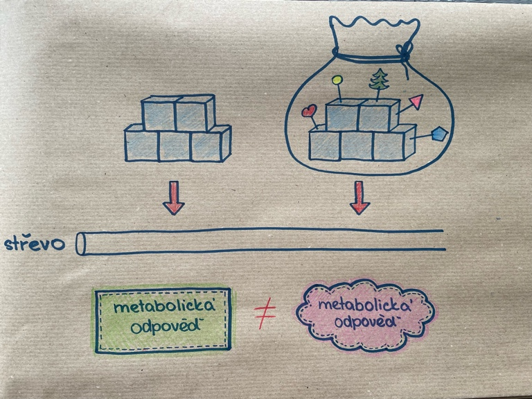
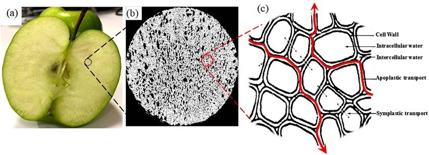
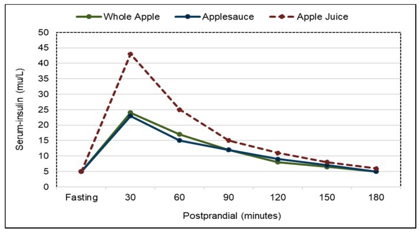
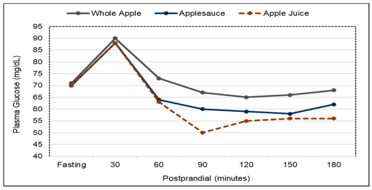
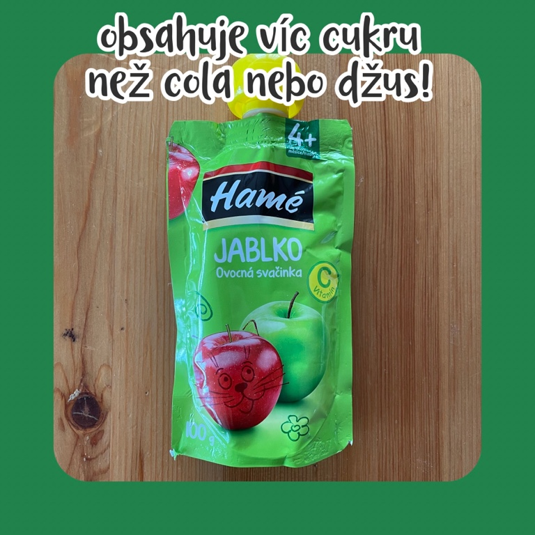
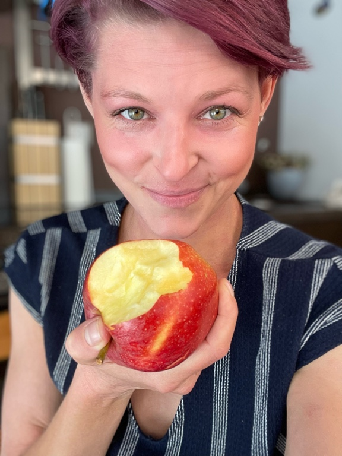

Co obsahuje víc kalorií a jednoduchých cukrů? Sklenice koly nebo jablečného džusu? A co jablečný džus a jablko? Mají stejný efekt na vaše tělo? Na to se podíváme v tomto článku.



Pokud jste tipovali, že je víc sladká kola, tak jste se mýlili. Stoprocentní jablečný džus obsahuje o trošku víc jednoduchých cukrů než cola. A co když porovnáme džus a celé jablko? Je vašemu tělu jedno, co z toho si vyberete?

> NENÍ! Velice totiž záleží na formě, v jaké do sebe jednoduché cukry dostanete.

## Na formě záleží

Představte si dva případy. V obou máme stejné množství cukru a v prvním případě je ten cukr samotný. Když sníte samotný cukr, ve vašem těle se vstřebá do krevního oběhu a v těle vznikne odpovídající metabolická odpověď. Tenhle cukr vyvolá ve vašem těle nějaký EFEKT. Ve druhém případě ten cukr není sám, ale spolu s ním tam je ještě spousta dalších komponent. Tentokrát se cukr také vstřebá a vyvolá metabolickou odpověď, ale tyhle ostatní komponenty můžou do procesu zasáhnout. Některé mohou zrychlovat nebo zpomalovat vstřebávání, některé se mohou ko-absorbovat (vstřebávat společně) a některé ovlivňují střevní mikroflóru, která má následně vliv na činnost střev. 

> Výsledný EFEKT nemusí být stejný, přestože se jedná o stejné množství stejné látky!

Představte si to, jako když jedete na dovolenou. Když pojedete sami, pravděpodobně dopadne jinak, než když pojedete s rodinou a malými dětmi, s partou kamarádů nebo s tchýní. Výsledek bude pokaždé jiný :) 

## Rozdíl mezi jablkem a jablečným džusem
Stejně je tomu i u jablečného džusu a jablka. V jablečném džusu jsou jednoduché cukry ve volné podobě, takže je tělo nemusí nijak dál trávit a štěpit a mohou rovnou přejít přes střevní stěnu do krevního oběhu. Rychlost vstřebání je velká. 

Oproti tomu rychlost vstřebání cukru z jablka je pomalejší, protože jablko obsahuje další komponenty. První rozdíl nastává už v žaludku, který se vyprazdňuje pomaleji, pokud sníte jablko, než když vypijete džus. Dále je rozdíl ve struktuře. Jablko na řezu vypadá jako spousta malých cisterniček z vlákniny, které obsahují cukerné roztoky. Při trávení jablka se musí cisterničky nejprve narušit pomocí žvýkání a střevních bakterií, aby se z nich mohly cukerné roztoky dostat.

## Po vypití džusu se uvolní víc inzulinu

Na tomto grafu vidíte množství uvolněného inzulinu po tom, co sníte jablko (zelená křivka) nebo vypijete jablečný džus (červená křivka). Tím, že jsou v džusu jednoduché cukry ve volné formě a rychle se vstřebávají, je to pro tělo velká nálož cukru najednou. Tělo na to reaguje uvolněním velkého množství inzulinu, aby se udržela krevní glykémie v rozumném intervalu. Z jablka se cukry vstřebávají pozvolněji a uvolní se méně inzulinu. 

> Záleží nejen na množství ale i na koncentraci v čase!

U jablka i džusu je výsledná nejvyšší glykémie (koncentrace glukózy v krvi) srovnatelná, ale u džusu je to za cenu většího množství inzulinu. Ten za pár desítek minut způsobí, že se glykémie sníží (propad červené křivky v 90. minutě), což náš mozek vyhodnotí: "Hele, měl/a by sis dávat bacha, abychom se nedostali do hypoglykémie. Běž si radši něco sníst!" A my dostaneme na něco chuť. Nebo hlad. Honí nás mlsná. A nepřestane, dokud si fakt pro něco do špajzu nedojdeme. 

## Výkyvy inzulinu a glykémie vedou k rozvoji inzulinové rezistence
Ono se párkrát nic nestane. Pokud ale pijete džusy, smoothie a rovnou k tomu přidám všechny slazené nápoje pravidelně, denně a ve velkých objemech, dochází ve vašem těle neustále ke zvedání hladiny inzulinu. A čeho je moc, toho je příliš. Tělo se časem začne bránit rozvojem inzulinové rezistence, která spolu s velkou kalorickou náloží těchto nápojů vede k nadváze, obezitě, metabolickému syndromu, cukrovce a  celé řadě dalších civilizačních chorob. 

## Není pyré jako pyré
Na výše uvedených grafech bylo znázorněno ještě jablečné pyré, jehož křivka byla srovnatelná s křivkou celého jablka. Ale pozor, to pouze v případě, že se jedná o stoprocentní jablečné pyré bez dalších přidaných látek. Něco jako když si doma najemno nastrouháte jablko.

Jablečné pyré je i tato kapsička, dokonce doporučována dětem od 4 měsíců věku. Když se podíváte na složení, tak kromě jablka, kterého tam je 85%, tam je ještě kukuřičný škrob a glukózo-fruktózový sirup. To jsou volné cukry, které se rychle vstřebávají, a proto bude mít tato kapsička křivku spíš jako džus než jako celé jablko. A mimochodem, obsahuje víc jednoduchých cukrů než coca-cola nebo jablečný džus!

Cukr se dnes přidává do většiny zpracovaných potravin a jíme ho nadbytek. Nejhorší ale je, když ho cpeme do našich dětí už od útlého věku. 

> Raději věnujte 2 minuty svého času a dětem jablko nastrouhejte!

## Co z toho vyplývá

1. NA FORMĚ ZÁLEŽÍ. 
Mnoho studií prokázalo pozitivní vliv pravidelné konzumace celého čerstvého ovoce na lidské zdraví. Zlepšuje kvalitu trávicího traktu, mikrobiomu, snižuje riziko kardiovaskulárních chorob, metabolického syndromu, obezity a snižuje riziko některých typů rakoviny. Oproti tomu pravidelné pití slazených nápojů včetně džusů vede ke ztučnění jater, rozvoji inzulinové rezistence a následně diabetu, obezity atd. Pokud by vás detailněji zajímalo, jakým mechanismem k tomu dochází, podívejte se na můj článek a video o [fruktóze](/metabolismus/nenicukrjakocukr/), kde to vysvětluji podrobně. 

2. DÁVKA DĚLÁ JED. 
Tohle platí v jídle naprosto ve všem. Když denně sníte 5kg banánů, nejspíš to pro vaše tělo  dobré nebude. Zároveň když si občas dáte skleničku kvalitního moštu nebo i coly (pokud na tom trváte), tak se taky houby stane. Vše je o rovnováze. Nemusíte všechny “nezdravé” potraviny striktně vyškrtat, ale mějte představu o tom, co dělají s vaším tělem a podle toho korigujte jejich množství. 

## Závěr
Tak, abych se vrátila na začátek. Z hlediska cukru je skoro jedno, jestli si dáte džus nebo coca-colu. Ale džus a jablko je rozdíl. Volba je na vás!

## Zdroje
- https://www.ncbi.nlm.nih.gov/pmc/articles/PMC6315720/ - Whole Fruits and Fruit Fiber Emerging Health Effects
- https://www.sciencedirect.com/science/article/pii/S0022316622023586?via%3Dihub - Processing Apples to Puree or Juice Speeds Gastric Emptying and Reduces Postprandial Intestinal Volumes and Satiety in Healthy Adults
- https://www.sciencedirect.com/science/article/pii/S0002916522026697?via%3Dihub - Plasma glucose and insulin responses after consumption of breakfasts with different sources of soluble fiber in type 2 diabetes patients: a randomized crossover clinical trial
- https://www.researchgate.net/publication/328251211_Fundamental_Understanding_of_Cellular_Water_Transport_Process_in_Bio-Food_Material_during_Drying - Fundamental Understanding of Cellular Water Transport Process in Bio-Food Material during Drying
- https://www.mdpi.com/2304-8158/11/21/3518 - Variation in Cell Wall Metabolism and Flesh Firmness of Four Apple Cultivars during Fruit Development
- https://www.copcp.com/Media/cd7c9053-e78b-437a-b008-b8d236678e40.pdf - Sugar in fruits versus added sugar
- https://www.ncbi.nlm.nih.gov/pmc/articles/PMC2664987/ - The effect of fruit in different forms on energy intake and satiety at a meal
- https://pubmed.ncbi.nlm.nih.gov/71495/ - Depletion and disruption of dietary fibre. Effects on satiety, plasma-glucose, and serum-insulin