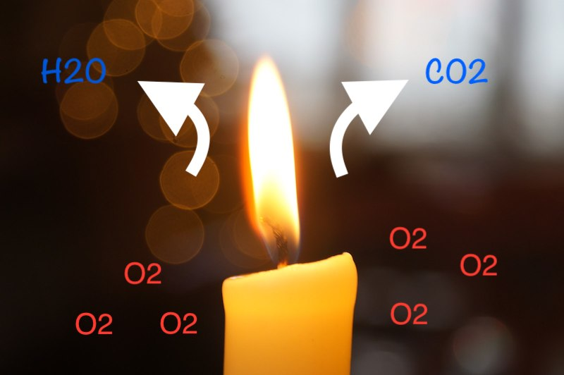
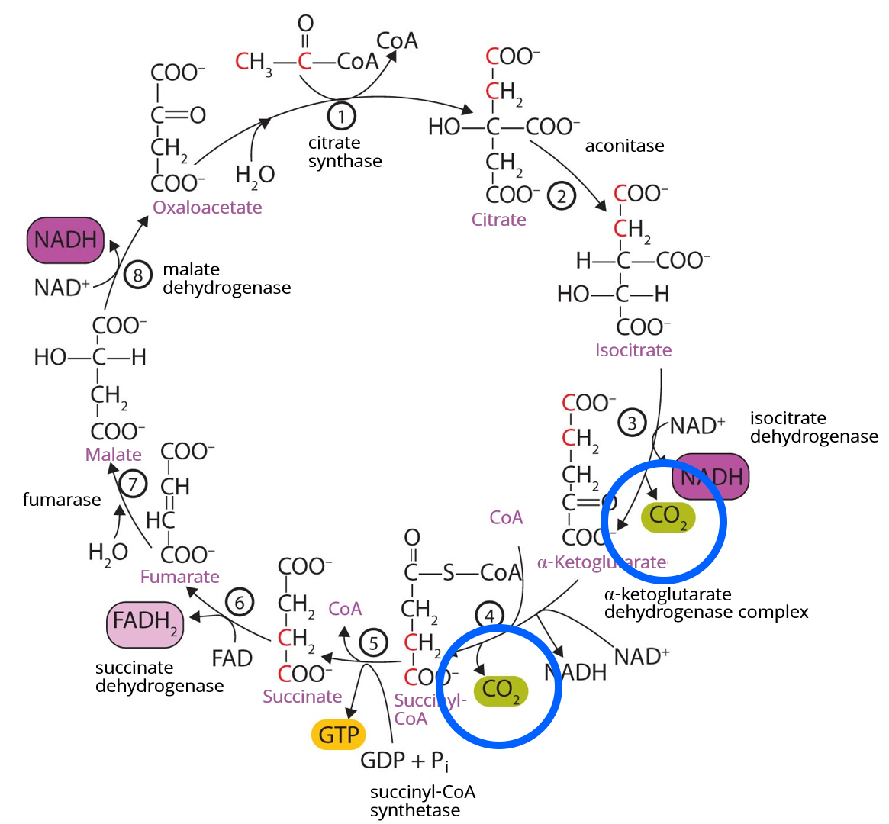

Víte, co je to kalorie? Víte, že i vaše auto má kalorický výdej? Kdy je dobré kalorie počítat a proč to není vůbec jednoduché? A co se stane s tukem, který jste shodili? To vše se dozvíte v dnešním článku o kaloriích.



## Hoření svíčky je spalování uhlíku kyslíkem na oxid uhličitý a vodu
Kalorie je jednotka popisující množství tepla vzniklého při nějakém procesu a zdaleka se nepoužívá pouze u člověka a výživy. Kalorii a lidský metabolismus si dneska vysvětlíme na analogii s hořící svíčkou. Hoření je řízené spalování uhlíku kyslíkem na oxid uhličitý a vodu a podobný proces probíhá i v našich buňkách. 

Tělo svíčky je tvořeno parafínem, který má vzorec C31H64. Jak plyne čas, parafín se postupně topí a je nasáván k hrotu svíčky, kde probíhá spalování díky kyslíku v okolním vzduchu. Vlivem tepla z plamínku se uhlíkatý řetězec parafínu rozpadá na samostatné uhlíky a vodíky. Uhlíky se spojují s kyslíkem a vzniká CO2. Vodíky se spojují s kyslíkem za vzniku vody, která se při tak vysoké teplotě ihned odpařuje.

 Plamínek produkuje také teplo a záření v různých vlnových délkách. Podle barvy plamene se dá určit, jestli probíhá dokonalé spalování, tedy že nevznikají vedlejší produkty. Na plynovém sporáku je plamen zbarven do modra, což znamená, že zde je spalování úplné. Svíčka hoří žlutým plamínkem, a to znamená, že je spalování nedokonalé a kromě CO2 vzniá i CO a uhlíkový prach. 
 
 Abychom si to shrnuli:

> k hoření svíčky je potřeba kyslík ze vzduchu a parafín, tedy molekula obsahující uhlík a vodík. Hořením se parafín rozpadá a vzniká CO2 a H2O, světlo, infračervené záření, teplo a další produkty jako CO a uhlíkový prach. 

Naše tělo funguje podobně, akorát si můžete představit, že je tento plamen rozložen do všech vašich buněk a jejich mitochondrií, což jsou buněčné organely, ve kterých oxidace probíhá. Stravou jíte živiny, které obsahují uhlík, vodík a kyslík. Plícemi vdechujete vzduch obsahující kyslík. To vše se potkává v mitochondriích, ve kterých stejně jako u svíčky vzniká CO2, metabolická voda a energie. Cílem tohoto procesu je vyrobení ATP, energetické molekuly, kterou tělo dokáže využít ke svému fungování. Pojďme se na to podívat trošku detailněji. 

## Lidský metabolismus funguje jako svíčka

Na obrázku je nakreslená hořící svíčka a vlevo dole jsou cukry a tuky, které sníme. Jsou to molekuly obsahující atomy uhlíku, vodíku a kyslíku a metabolismem se postupně jejich složité molekuly mění na jednodušší. Výsledný produkt, acetyl-koA vstupuje v mitochondriích do citrátového cyklu. 

V tomto místě dochází ke vzniku CO2, stejně jako u svíčky, u které se rozkládá parafín. Ze svíčky CO2 uniká do prostoru, my ho vydýcháme. Vodíky pokračují do dýchacího řetězce, který se nachází na vnitřní membráně mitochondrií, a zde vytváří tlak, který je hybnou silou pro ATP-syntázu. To je pumpa, která vytváří molekuly ATP. Vodíkové kationty se hromadí na jedné straně membrány a roztáčí ATP-syntázu podobně jako voda roztáčí vodní turbínu. To otočení má za následek vytvoření molekuly ATP. Po provedení svého úkolu se vodíky vrací dovnitř mitochondrie, kde se spojují s kyslíkem a vzniká tzv. metabolická voda. Voda vzniklá při hoření se ihned odpaří, v těle se nadbytečná voda vylučuje močí příp. pocením. 

Tak jako u svíčky, i v lidském těle probíhá forma nedokonalého hoření. U svíčky vznikají saze, které znečišťují okolí, v našich buňkách vznikají volné radikály. Pod volnými radikály si můžeme představit vedlejší produkty nedokonalého hoření s elektrony navíc. Tyto molekuly přímo nebo nepřímo poškozují lipidy nebo proteiny v buňkách a tím se buněčné procesy stávají neefektivní. Buňka může i zemřít. Kromě oxidace v mitochondriích je zdrojem radikálů třeba náš imunitní systém, který je využívá v boji proti patogenům, nebo environmentální faktory, jako je UV záření, RTG nebo toxické látky v okolí. Příkladem je hydroxylový radikál OH-, který vzniká např. v buňkách pokožky, pokud ji intenzivně vystavujete UV záření. Hydroxylový radikál přímo poškozuje buněčnou DNA, což má za následek stárnutí pokožky. Proti vznikajícím radikálům má ale tělo přirozenou obranu. Bojuje proti nim pomocí antioxidantů. Jedním z antioxidantů je např. kyselina lipoová, která je nejenom sama antioxidant, ale zároveň dokáže regenerovat i další antioxidanty v těle. V potravinách se běžně vyskytuje v kvasnicích, játrech, špenátu, brokolici nebo v bramborách. Ve zvýšených dávkách ji používají sportovci jako doplněk stravy při intenzivním cvičení. Pokud tělo nedokáže volné radikály efektivně znehodnocovat, vzniká oxidační stres, který zpomaluje mitochondrie. 

## Co se stane s tukem, který jste shodili?

Stejná otázka byla položena 50 lékařům, 50 výživovým poradcům a 50 fitness trenérům v Austrálii. 

Většina z nich odpověděla, že se tuk ztratí ve formě energie, někteří si myslí, že tuk vypotíme nebo vykadíme. Někteří dokonce přiznali, že neví. Co je váš tip? 

 > Zhubnutý tuk vydýcháte!
 
  Základem molekuly tuku je atom uhlíku, který, jak už víme z analogie se svíčkou, se váže na kyslík při spalování a vytváří s ním CO2, který vydechujeme. Pokud se vám to nezdá, vezměme si to ještě z druhé strany. Spousta lidí ví, že vdechujeme kyslík a vydechujeme CO2. Napadlo vás ale někdy, odkud se uhlík, přilepený na kyslík vezme? Je to uhlík, který pochází z živin, které sníte a spálíte. Pokud spálíte tuk, jeho řetězce se metabolismem rozpadnou a uhlíky se napojí na kyslík a vytvoří CO2. 

## Za jak dlouho vydýcháte jablko? Nebo hamburger?

V klidovém stavu vydýcháme cca 8,3g uhlíku za hodinu. Z celý den je to 200g a za rok 73kg. Můžeme spočítat i za jak dlouho vydýcháme různá jídla. 

Co třeba jablko? Za jak dlouho vydýcháte jablko, když jste v klidu? Za 1 hodinu. Jahodovo-banánové smoothie? Za 4. Pokud se půjdete projít, tak smoothie vydýcháte za hodinu, pokud poběžíte, tak za 30 minut. Protože při pohybu dýcháte víc. Co velké cappuccino s kouskem dortu? 10 hodin. Velký burger - 7 hodin. Když si k němu dáte velké hranolky - 13 hodin. K tomu velkou Colu - 16 hodin. Plus čokoládový McFlurry - 24 hodin dýchání. 

Tady bych si dovolila jednu poznámku. 
 > Nedá se efektivně zhubnou tím, že budete doma v klidu před telkou dýchat víc!
 
 Tělo má přesnou regulaci dýchání a pokud začnete hyperventilovat, s největší pravděpodobností se vám začne motat hlava a pokud byste pokračovali, můžete ztratit vědomí. Prosím doma to nezkoušejte. Radši se jděte projít!

## Kalorický výdej
Ukažme si tady jednu rovnici spálení tuku. 

Na spálení 10kg tuku je potřeba 29kg kyslíku a vznikne 28kg CO2, 11kg vody a 94 048kcal energie. A tady se již dostáváme k jádru pudla.

Při oxidaci se vyprodukuje tepelná energie a právě tu popisujeme pomocí kalorií. To je váš kalorický výdej. Kalorie, které vaše tělo vytvoří při oxidaci živin a stejně tak svíčka při svém hoření. Je to tepelná energie, která vzniká při procesu výroby ATP. ATP je energetická molekula, jejíž energii tělo využít dokáže. Námi počítané kalorie jsou tepelná energie vznikající při výrobě ATP a tělo ji využít nedokáže. Musí proto tělo opustit. 

Představte si kávovar, na kterém si děláte kávu. Zapnete ho, chvilku to trvá, než se nahřeje, uvaří vodu, ale výsledkem je lahodné espresso. Výsledkem je káva, což je v našem těle molekula ATP. Množtví tepla, jak moc se kávovar zahřeje, je množství kalorií. Čím víc káv bude kávovar připravovat, tím víc se zahřeje. Čím víc se my budeme hýbat, tím větší kalorický výdej budeme mít. Pokud půjdete běhat, budete mít větší tepelný a tedy kalorický výdej než při ležení na gauči. 

> Zajímavost: tělo dokáže využít pouze velmi malou část energie molekul cukrů, tuků a bílkovin a to tu, která je uložená v chemických vazbách. 
> - Pokud by naše tělo dokázalo rozložit molekuly živin až na samotné jádro, dokázalo by např. z 1g tuku uvolnit tolik energie, kolik by se uvolnilo z 1,5 bomby shozených na Hirošimu!
 

Tepelná energie se musí z těla dostat ven, aby nedocházelo k přehřívání. Ze 40% se z těla dostává jako teplo povrchem kůže nebo plícemi a 60% jako infračervené záření. Záření probíhá ve všech vlnových délkách, ale při naší tělesné teplotě nejvíce v infračerveném spektru. Proto můžeme snímat lidské tělo a ostatní teplokrevné živočichy infračervenou kamerou. Můžete si představit, že vaše tělo září jako baterka, ale světlem, které okem nevidíte. 

## Kolik této tepelné energie tělo vytvoří? 
Člověk bez větší fyzické aktivity má rychlost bazálního metabolismu přibližně 100W. 

 > Naše parafínová svíčka má 60W, takže pokud jsme v klidu, tak se dá rychlost našeho metabolismu přirovnat k hoření dvou těchto svíček.
 
**100 Watt = 100 J/s ~ 8 640 000 J/den = 8 640 kJ/den = 2 067 kcal/den**

Watt je jednotka 1 Joule za sekundu. 100 Wattů je 100 Joulů za sekundu. Pokud spočítáme bazální metabolismus za celý den, tak je to 8 640 000 J, což je 8 640 kJ, a to je 2 067 kcal. Tohle číslo už vám možná bude povědomé. Udává se jako doporučené množství, které by měl člověk za den sníst, aby pokryl svůj bazální energetický výdej. Každý má samozřejmě jiné potřeby, kulturista bude mít větší bazální výdej než drobná žena, takže toto číslo je pouze orientační. 2 000 kcal je zhruba tepelná energie 10 svíček. Nejenže záříte jak baterky, ale každý den vyhoříte tolik tepla jako 10 svíček. 

Takže tohle je ta kalorie. Tepelná jednotka, která určuje množství tepla. U člověka je to teplo, které vzniká spalováním živin, které sníme nebo které máme ve svých tělesných zásobách. U svíčky je to teplo, které cítíme okolo, když hoří. I vaše auto má kalorický výdej. Kávovar má kalorický výdej, když dělá kávu. Kalorie platí všude, kde teplo vzniká.

 > Zajímavost: kalorie byla původně zavedena pro popis efektivity parního stroje. 

## Rychlost metabolismu se v čase mění
Rychlost našeho metabolismu není během našeho života konstantní. Podívejme se na 5 věcí, které jí ovlivńují:

**1. Věk**

Rychlost metabolismu se mění věkem, což znázorňuje tento graf. Aby se to dalo porovnat, je to přepočteno na kilogram tzv. lean mass (veškerá tělesná hmota kromě tuku). Kojenci mají zhruba o polovinu rychlejší metabolismus než dospělý člověk. Během dětství a dospívání rychlost metabolismu postupně klesá a zůstává konstantní během dospělého života. Po 60ce začne pomalu klesat především kvůli úbytku svalů. Pokud bychom brali plamínek svíčky jako rychlost metabolismu dospělého člověka, měl by ho kojenec o polovinu větší a 85ti letý důchodce o pětinu menší. 

**2. pohlaví a aktivita**

Všeobecně mají ženy nižší energetický výdej než muži, což souvisí převážně se stavbou těla. Ženy mají v porovnání s muži větší procento tělesného tuku a méně svalové hmoty. V tabulce můžete vidět 5 denních činností od spánku až po intenzivní sporotvní aktivitu a také přepočet na množství hořících svíček najednou.

**3. poměr tukové a svalové hmoty**

Na rychlost metabolismu má vliv také skladba vašeho těla. Svaly vyžadují pro svoji práci velký přísun energie, takže čím víc svalů máte, tím máte větší energetický výdej. Naopak pokud v těle máte víc tuku než svalů, bude vaše rychlost metabolismu nižší.

**4. hormony**

Pokud se vám dlouhodobě nedaří zhubnout, je vhodné absolvovat vyšetření u vašeho lékaře, který vám může z krevních testů určit např. hladiny hormonů štítné žlázy. Zejména u žen bývají často snížené a nižší hladiny těchto hormonů způsobují pomalejší metabolismus. To může vést k únavě a nabírání váhy. 

## Lze kalorie spočítat a změřit?
Ano, je to možné, ale v běžné praxi se jedná pouze o hrubý odhad. 

#### Jak změřit nebo spočítat kalorický **PŘÍJEM**? ####

Množství kalorií je uvedeno na každé potravině v obchodě. Většinou je tam uvedeno množství kalorií na 100g potraviny, takže si musíte množství přepočítat podle toho, kolik toho sníte. Pokud vás zajímá kalorická hodnota vámi uvařeného jídla, najdete ji na internetu v kalorických tabulkách, případně to lze spočítat podle množství jednotlivých použitých surovin.  

Před uvedením na trh musí každá potravina projít měřením v laboratoři a získat svůj energetický štítek. Kalorie v jídle se měří pomocí přímé kalorimetrie. Dané jídlo se v laboratoři rozmixuje do homogenní hmoty, nechá se několik dní vysušit a výsledný suchý prášek se slisuje do malé tobolky. Ta se umístí do kalorimetru, kde se spálí, kalorimetr změří vydané teplo pomocí ohřáté vody a tak stanoví celkové množství kalorií v daném jídle. 

Zde je třeba podotknout, že kalorimetr spálí tu tobolku kompletně celou a výsledné číslo je maximálně teoreticky možné množství kalorií, které se dá získat oxidací živin, pokud bychom je kompletně vstřebali a spálili. Úskalí tohoto spočívá v tom, že máme:
1. tendenci podhodnocovat svůj příjem - takže si sice spočítáme množství přijatých kalorií, ale většinou sníme víc
2. ve střevě vše nevstřebáme a jídlo kompletně nespálíme 

 > Proto je množství spočítaných kalorií, které za den sníme, pouze HRUBÝ ODHAD!

#### Jak změřit nebo spočítat kalorický **VÝDEJ**? ####

Pokud bychom chtěli změřit náš bazální výdej úplně přesně, museli bychom přesně změřit příjem, množství vdechnutého O2, vydechnutého CO2, vyzářené teplo, vyloučenou vodu a odpadní produkty. Tento postup se nazývá přímá kalorimetrie. Měření lze provést ve speciálně upravených místnostech, které se v angličtině nazývají "metabolic chambers" a využívá se pouze pro vědecké účely. 

V běžné klinické praxi se využívá tzv. nepřímá kalorimetrie, při které se měří pouze množství vydýchaného CO2 a vdechnutého O2. Dýchací maska snímá dechové plyny když jste v klidu nebo při zátěži. V klidu se tím změří tzv. resting metabolic rate, což znamená klidová rychlost metabolismu. Měření při zátěži využívají především sportovci, kteří podle množství využitého kyslíku dokáží odhadnout efektivitu svých svalů. 

Pro běžné účely se dá rychlost metabolismu vypočítat pomocí vzorce, který zohledňuje věk, pohlaví, výšku, hmotnost a procento tuku v těle. Procento tuku v těle lze zjistit na bioimpedanční váze u lékaře, nutričního terapeuta nebo v dobrém fitnesscentru.

 > Příklad vzorce pro výpočet bazálního metabolismu:
 >
>BMR(ženy) = 655,0955 + (9,5634 × váha v kg) + (1,8496 × výška v cm) - (4,6756 × věk v letech)
>
>BMR(muži) = 66,473 + (13,7516 × váha v kg) + (5,0033 × výška v cm) - (6,755 × věk v letech)

Co je důležité si uvědomit - **tyto výpočetní vzorce odpovídají průměrnému člověku v dané kategorii a nezohledňují jakékoliv možné odchylky**.

 > Proto je i výpočet bazálního metabolismu pouze HRUBÝ ODHAD!

#### Chytré hodinky a fitness náramky ####

Fitness náramky a chytré hodinky jsou v dnešní době velice oblíbené. Sledují nám počet kroků, tepovou frekvenci a na konci dne nám vyhodnotí celkový denní kalorický výdej. Je ale to číslo přesné?

Fitness náramky využívají pro výpočet spálených kalorií téměř stejné vzorce a algoritmy, které jsme si uváděli výše. Do hodinek si zadáte svoje hodnoty a hodinky to přepočítají spolu s aktuálními daty, která o vás mají. Využívají pro to pohybový senzor, snímání frekvence srdečního tepu a novější modely také okysličení krve a měření tepla. I tak je ale nutné brát hodnoty spálených kalorií orientačně bez ohledu na to, kolik ty hodinky stály. Dle studií je měření méně přesné např. při aktivitách, kdy se nehýbe tolik rukama, jako je jízda na kole, když v klidu sedíte nebo před sebou tlačíte kočárek. Zároveň ve studiích vycházela odchylka v přesnosti měření 15-20%! Celkově nošení hodinek a náramků spíše motivuje k pravidelnému pohybu a plnění pohybových cílů. Je ale důležité si uvědomit, že hodinky vám vždy ukáží pouze číslo a je jen na vás, jakým způsobem ho vyhodnotíte. Může ve vás vzbudit pocit zklamání, že jste se dneska přece tak snažili a to číslo není moc vysoké. Nebo že jste dneska spálili hodně a můžete si na večeři dopřát. Ne to číslo samoté, ale vaše interpretace a následné kroky ve výsledku ovlivňují váš přístup k pohybu a zdravému životnímu stylu. 

 > I počet spálených kalorií na fitness náramku nebo chytrých hodinkách může být nepřesný!!!

Takže, teď si zodpovíme otázku.....
## Proč většina lidí nehubne? ##
Pro úspěšné hubnutí je NUTNÁ kalorická restrikce, což znamená, že množství přijatých kalorií je menší než množství spálených kalorií. Musíte sníst méně, než vydýcháte, abyste spálili něco ze svých tukových zásob. Pokud se vám nedaří zhubnout, ve většině případů prostě nejste v kalorické restrikci. Ikdyž si poctivě počítáte snězené kalorie a měříte se pomocí hodinek. Tato čísla jsou pouze hrubý odhad a je lepší se orientovat spíš podle váhy a centimetrů v pase. 

Bez kalorické restrikce zhubnout nelze. Ať už budete držet ketodietu nebo jíst nízkotučně, správně zvolená kalorická restrikce je nevyhnutelná pro váš úspěch. V základu o nic jiného než o kalorickou restrikci nejde. ALE!

Kalorický model zahrnuje pouze teplo, calories in - calories out, ne psychologii člověka, jeho psychosociální prostředí, ve kterém žije, stravovací návyky, hormonální systém. Stejně jako je u obézního člověka nutná kalorická restrikce, tak může být nutná i psychoterapeutická pomoc a koučink, které neskončí zhubnutím, ale budou následovat i dál a pomohou tomu člověku si váhu udržet. 

 > Zhubnout je ve výsledku jednoduché, ale pravé umění je si váhu udržet!
 
Souhrn 29 dluhodobých studií ukázal, že do 5 let od zhubnutí lidé naberou zpátky 80% toho, co předtím zhubli. Z toho vyplývá, že nemá význam dělat změny svého životního stylu pouze krátkodobě. Představte si, že si naplánujete dietu na čtvrt roku a povede se vám shodit pár kilo. Když ji přestanete dodržovat a vrátíte se ke svému původnímu stravování, tak se dostanete zase zpátky. 

## Jojo efekt ##

Tímto jsme se dostali k jednomu velice známému problému v souvislosti s hubnutím, a tím je jojo efekt. Kdo by ho neznal! Jojo efekt je opakovaný pokles a následně nárůst váhy, což je velice frustrující. Nahoru, dolu, stejně jako jojo. 

#### Jak vypadá typický jojo cyklus ####
Od pondělí začnu odhodlaně držet redukční dietu, začnu k tomu cvičit a opravdu se mi podaří zhubnout. Jsem motivovaná, okolí už si všimlo, pokračuju dál. Tělo se ale začne přizpůsobovat sníženému množství kalorií a se zhubnutými kily klesl můj kalorický výdej. Dieta už nejde tak rychle jako na začátku...a co! Vždyť už se vejdu do těch starých kalhot, tak už mi to stačí a můžu si občas něco dát. Ježiši jak mi chyběla čokoláda! Však stačí, když si tuhle váhu udržím. A už konečně začnu řešit něco jinýho než jídlo! Jenže najednou toho mám nějak hodně v práci, problémy doma, nestíhám uklízet, vlastně toho nestíhám hodně. Ještěže ta čokoláda a víno existují. 
Jenže postupně si začnu dopřávat častěji, začnu jíst stejně jako před zhubnutím (protože řešit do toho všeho jídlo, na to prostě nemám čas) a váha mi začne zase pomalu stoupat. Nejdřív si říkám, to je jen pár kilo, mám to pod kontrolou. Jenže za chvilku, ani nevím jak, už mám zase skoro jako předtím. Propadám zoufalství, stres, zklamání a pocit selhání dál zajídám, protože teď už je to přece jedno a váha vyleze ještě výš než předtím. Dlouhou dobu se tím trápím, přestože před ostatníma se snažím být nad věcí a budu doufat, že po nějaké době v sobě najdu další kousek motivace a odhodlání se do toho pustit znovu.

 Někdo z vás se v tom našel? 

## The biggest looser ##
V Americe je velmi populární televizní show s názvem The biggest looser, ve které mezi sebou soutěží obézní lidé o výhru tím, kdo z nich shodí víc kilo. Dieta, kterou dodržují, je založena na snížení kalorického příjmu na 70% běžného energetického příjmu a k tomu mají 6x týdně intenzivní (opravdu hodně intenzivní) fyzickou aktivitu. Soutěžící měli skvělé výsledky, v průměru zhubli za 30 týdnů natáčení 57 kilo tukové tkáně. 

Nikdy ale nebyla natočena série několik let poté, která by ukázala, jak se soutěžícím daří si váhu udržet. Nebo nedaří?

Po ukončení jedné řady show následovala studie 14 účastníků. Zde je graf, kde je ukázán vývoj váhy účastníků po 6 letech od soutěže a rychlost jejich metabolismu. 

 > Pouze jedné ženě se podařilo váhu udržet, jinak všichni nabrali zpět a 4 z nich mají váhu vyšší než před soutěží. 
 
Intenzivním tréninkem a striktní dietou si snížili rychlost metabolismu, protože tělo neumí pracovat na dluh. Většině účastníků zůstala rychlost metabolismu snížená i po 6ti letech - tento efekt může být dlouhodobý. 

## Udržení váhy po zhubnutí je klíčové! ##
V roce 2015 vyhodnotili ve Velké Británii zdravotní záznamy praktických lékařů u 175 000 obézních lidí za 9 let a sledovali úspěšnost jejich hubnutí. **Alespoň 5% váhy zhublo 12,5% mužů a 14% žen, nicméně víc jak půlka z nich to do 2 let nabrala zase zpátky a do pěti let 78% z nich.** 

 > Tahle čísla se dají vyložit tak, že krátkodobě zhruba 12% obézních lidí zhubne, ale většina z nich to dlouhodobě to nedokáže udržet! 

Dostaví se jojo efekt, další frustrace a mnoho lidí svůj boj vzdá a navrátí se ke svým starým zvykům. Běžné rady a naléhání, které slýcháváte od svého lékaře: "měl/a byste zhubnout, víc se hýbejte, omezte sladké a množství piva..." atd atd...**NEFUNGUJÍ**! Protože tyto rady jsou úplně prázdné. Nic nevysvětlují a nepomáhají změnit zaužívané vzorce chování. 

## Nebuďte na to sami! ##
Na inspiraci k dlouhodobému hubnutí se můžeme podívat na studii Look AHAED, která sledovala po dobu 9ti let přes 5 tisíc obézních lidí s diabetem. Lidé byli rozděleni do dvou skupin. V té první dostávali obecné informace o výživě, diabetu, zdravém životním stylu a pohybu 3x ročně. Ve druhé skupině měl každý účastník svého kouče, trenéra a nutričního specialistu, které ze začátku vídali 1x týdně, posléze se intervaly prodlužovaly. V této skupině se tvůrci studie snažili aplikovat veškeré dostupné metody a guidelines, které byly momentálně k využití. Všichni účastníci byli pravidelně měřeni, váženi a byly jim prováděny laboratorní a výkonostní testy. 

Skupina se základními informacemi je značena červenou
barvou a skupina s intenzivním dohledem je značena modře. Je evidentní, že **intenzivní péče vedla k razantnějšímu poklesu hmotnosti i k větším fyzickým výkonům**. Po prvním roce začala váha v modré skupině opět mírně narůstat. Snížila se četnost návštěv specialistů, poklesla jejich fyzická aktivita a mnozí účastníci již vystoupili z kalorické restrikce, kterou měli nastavenou po dobu hubnoucí fáze. Studie byla ukončena po devíti letech s tím, že konečný rozdíl ve zhubnuté váze nebyl nijak zásadní. 

> Co je ale důležité: lidé ani v jedné skupině na to nebyli sami! 

Pro zhubnutí a zbavení se obezity je podstatné porozumění základních principů výživy a zároveň sebeuvědomění a rozklíčování, proč jsem se do takového stavu dostal/a. Konzultace psychoterapeuta nebo kouče může být stejně důležitá jako konzultace nutričního specialisty. Nestačí “jen” jednorázově zhubnout, ale naprosto kritické v udržení váhy je schopnost vykompenzovat menší nárůsty váhy ve chvíli, kdy se objeví. A oni se objeví. V tu chvíli je důležité je nepopírat, zaměřit na ně pozornost a aktivně pátrat po příčinách. Mám stres v práci? Stres doma? Naložila jsem si toho na sebe hodně? Začala jsem zase jíst denně celou čokoládu? Nebo pít energeťáky abych zvládla pracovní tempo? Je potřeba to řešit a nenechat se uchlácholit pocitem, že to mám pod kontrolou. Psychoterapeut vám pomůže rozklíčovat problémy schované za emočním zajídáním. Z mé osobní zkušenosti to mohu maximálně doporučit. **Nebojte se říci o pomoc. Nebuďte na to sami**!

> Je důležité si najít k jídlu zdravý vztah. Přestat brát jídlo jako nálepku na svoje problémy. Užít si dobré jídlo bez výčitek. Najít si ve stravování svoji rovnováhu. 

## Není kalorie jako kalorie ##
Dnes už na základě našich znalostí o metabolismu a hormonech víme, že není jedno, z čeho přijaté kalorie pochází. Je rozdíl, pokud sníte 200kcal v brokolici nebo v hranolkách. Brokolice obsahuje vlákninu minerály a vitamíny. Hranolky obsahují jenom škrob a přepálený olej. Jsou nutričně chudé. 

> V dnešní době jíme hyperkaloricky, protože žijeme v obezitogenním prostředí. 

Průměrný Američan sní denně kolem 3000kcal a většinu v podobě zpracovaných jídel plných rafinovaných cukrů a olejů. A přitom na všem, co dáte do pusy, záleží. Vysoké množství cukru ve stravě aktivuje části vašeho DNA tak, aby se vytvářelo větší množství enzymů potřebných při lipogenezi, tedy při výrobě tuku. Jídlo má vliv na náš mikrobiom, který následně ovlivňuje naši psychiku. **Jídlo nás doslova programuje**. 

> A nezáleží jenom na tom, kolik toho jídla sníme, tedy na počtu kalorií, ale i jaké jídlo jíme. Na dobrém jídle záleží!

## Své jídlo by měl řešit každý ##
V minulosti jedli nutričně chudou stravu hlavně chudí lidé, cestovatelé nebo třeba námořníci na dlouhých zámořských plavbách a trpěli chorobami spojenými s nedostatkem vitamínů. Dneska se nutričně chudou stravou můžeme dopracovat i k obezitě. Obézní lidé totiž často paradoxně trpí podvýživou. Mají obrovské zásoby kalorií ve formě tuku, ale chybí jim vitamíny a minerály. 

Na grafu vidíme studii na 6000 lidech středního věku a vidíte zde 4 barevné křivky. Lidé byli rozděleni do 4 kategorií podle toho zda byli hubení/obézní a dobře živení/podvyživení. Modrá jsou hubení dobře vyživení, zelená obézní dobře vyživení, žlutá hubení podvyživení a červená obézní podvyživení. 

Největší úmrtnost měli obézní podvyživení lidé a druhá skupina s nejvyšší úmrtností byli hubení podvyživení lidé. Z tohoto plynou dva závěry:

> 1. i obézní člověk může být podvyživený
> 2. i když je člověk hubený, ještě to nemusí znamenat, že je zdravý. 

A jaký nám z toho všeho plyne závěr?
> **řešit své jídlo by měl každý. NA DOBRÉM JÍDLE ZÁLEŽÍ!**

## Závěr ##
Náš metabolismus nefunguje osamoceně, ale je to součást velkého životního koloběhu. Život začíná v rostlinách, které procesem zvaným fotosyntéza přijímají energii ze slunce a ukládají ji do škrobů, glukózy a fruktózy, které vážou uhlík z CO2 do sacharidových molekul. Rostliny sní živočichové, kteří tyhle molekuly oxidují na energii a zpátky na CO2. Jak jsou rostliny potravou pro živočichy, tak CO2 vyprodukované živočichy i člověkem je zase potravou pro rostliny. Živočišná a rostlinná říše jsou si navzájem prospěšné. V přírodě probíhá neustálý koloběh přetváření uhlíku z jedné formy na druhou a transportování energie ze slunce do buněk. To je princip existence života na naší zemi. Ukázali jsme si, že hoření svíčky je oxidací uhlovodíků a probíhá ve všech našich buňkách. 

Na závěr použiji slova fyzika Michaela Faradaye, který proslul svými přednáškami o svíčce, která nám sloužila a stále slouží jako velká insiprace. 
> "Nyní vidíte shodu mezi dýcháním a hořením v celé šíři. Tak jsme při zkoumání chemických procesů hořící svíčky poznali nejen mnoho základních chemických a fyzikálních zákonů, ale dospěli jsme také k jevům shodným s těmi, které probíhají v živém organismu. Tím zakončíme naše přednášky, neboť dříve či později musí všecko nějak skončit. A na závěr našeho společného zkoumání dovolte, milí přátelé, abych vám vyjádřila jedno přání: nechť je váš život skutečně jako svíčka, nechť přináší lidstvu světlo, nechť vždycky září pro radost vaši i všech ostatních."

## Zajímavost: historie kalorie ##
Kalorie začala svoji cestu v 18. století. Pomocí kalorie chtěli lidé v té době popsat, kolik energie získají z 1kg uhlí a jak mohou zvýšit efektivitu parních strojů. To, že lidské tělo využívá kyslík k tvorbě tepla už lidé věděli koncem 18. století, když francouzský chemik Lavoisier objevil kyslík a podrobně popsal oxidaci. To spustilo další vlnu objevů, protože do té doby byl vzduch považován za jednosložkovou látku. Lavoisier byl schopný čistý kyslík extrahovat a demonstroval to tak, že v baňce s kyslíkem svíčka hořela víc než v baňce se vzduchem. Stejně tak myši, které byly zavřené v baňce s čistým kyslíkem, nezemřely a tím bylo prokázáno, že právě kyslík je pro náš život důležitý. 

V 19. století se kalorimetrie uchytila také v zemědělství, kdy lidé začali zjišťovat, jak optimálně krmit hospodářská zvířata. Na měření energetické hodnoty pšenice se používal kalorimetr, kde se uvnitř přesně zvážené množství pšenice spálilo a vyprodukované teplo ohřálo vodu okolo. Stačilo změřit, o kolik se voda ohřála. A přesně z tohoho období pochází i dnes používaná definice kalorie:
> ohřev 1 kg vody o 1 stupeň Celsia.

V 19 a na začátku 20 století se začalo s obdobným výzkumem na lidech, kde se chemici snažili zjistit, jaká je optimální strava pro člověka. Významně se o to zasadil americký chemik **Wilbur Olin Atwater**, který popsal kalorickou hodnotu jednotlivých makronutrientů a měřením přišel na to, že energetický výdej člověka v klidu je okolo 2000kcal. Atwater už ve své době zjistil, že není jedno, z čeho kalorie pochází a např. že alkohol se v těle také oxiduje a tělo ho využívá na tvorbu energie. Toho se hned chytily společnosti vyrábějící alkohol a začaly tím promovat svoje výrobky. Atwater ale věděl, že alkohol není nutričně bohatý a že nadměrná konzumace alkoholu škodí. Vadilo mu, že jeho výzkum byl takto zneužit a ve svých veřejných přednáškách vždy propagoval abstinenci. 

## Zdroje ##
- Co se stane se zhubnutým tukem? - https://www.bmj.com/content/349/bmj.g7257
- Matematika hubnutí - https://www.youtube.com/watch?v=vuIlsN32WaE
- Propojení dýchání a metabolismu - https://www.youtube.com/watch?v=nM-ySWyID9o
- Dokonalé a nedokonalé spalování - https://cs.strephonsays.com/difference-between-complete-combustion-and-incomplete-combustion
- Lékařská biofyzika - https://is.muni.cz/www/384/30618506/koncepty/Physics_in_Biology_and_Medicine_3rd_Edition.pdf
- Typy záření a jejich interakce s hmotou - http://hyperphysics.phy-astr.gsu.edu/hbase/mod3.html#c1
- Michael Faraday, Tajemství svíčky - https://www.chemtk.cz/default/files/download/id/85306/faraday-svicka-cz.pdf
- Michael Faraday, The chemical history of a candle - https://engineerguy.com/faraday/pdf/faraday-chemical-history-complete.pdf
- Přepočet Watt na kalorie - https://gearandgrit.com/convert-watts-calories-burned-cycling/
- ATP syntáza - https://www.youtube.com/watch?v=kXpzp4RDGJI
- Volné radikály - https://postudium.cz/mod/resource/view.php?id=5428
- Rychlost metabolismu při kalorické restrikci - https://www.ncbi.nlm.nih.gov/pmc/articles/PMC9036397/ 
- Jojo efekt - https://www.ncbi.nlm.nih.gov/pmc/articles/PMC6917653/
- Metaanalýza klidového metabolismu obézních osob - https://academic.oup.com/ajcn/article/69/6/1117/4714917 
- Velký kalorický výdej maskuje málo pohybu u obézních - https://www.ncbi.nlm.nih.gov/pmc/articles/PMC4879834/
- Kalorický výdej v průběhu života - https://www.ncbi.nlm.nih.gov/pmc/articles/PMC8370708/pdf/nihms-1718676.pdf
- Metabolismus a věk - https://www.health.harvard.edu/blog/surprising-findings-about-metabolism-and-age-202110082613
- Studie The biggest looser - https://onlinelibrary.wiley.com/doi/full/10.1002/oby.21538
- Fitness náramky a proč je nevydržíme sledovat - https://www.sciencedirect.com/science/article/abs/pii/S0747563219303127 
- Efektivita fitness náramků pro zlepšování kondice - https://www.thelancet.com/action/showPdf?pii=S2589-7500%2822%2900111-X 
- Přesnost měření fitness náramků - https://bjsm.bmj.com/content/54/6/332, https://pubmed.ncbi.nlm.nih.gov/34957939/ 
- Asociace obezity a malnutrice, kohortová studie - https://www.ncbi.nlm.nih.gov/pmc/articles/PMC8205172/
- Pravděpodobnost úspěchu hubnutí u obézního člověka, kohortová studie - https://pubmed.ncbi.nlm.nih.gov/26180980/
- Weight regaining review - https://www.sciencedirect.com/science/article/abs/pii/S0026049515002255?safesearch=moderate&setlang=en-XL&ssp=1
- Studie Look AHAED - https://www.ncbi.nlm.nih.gov/pmc/articles/PMC4339027/