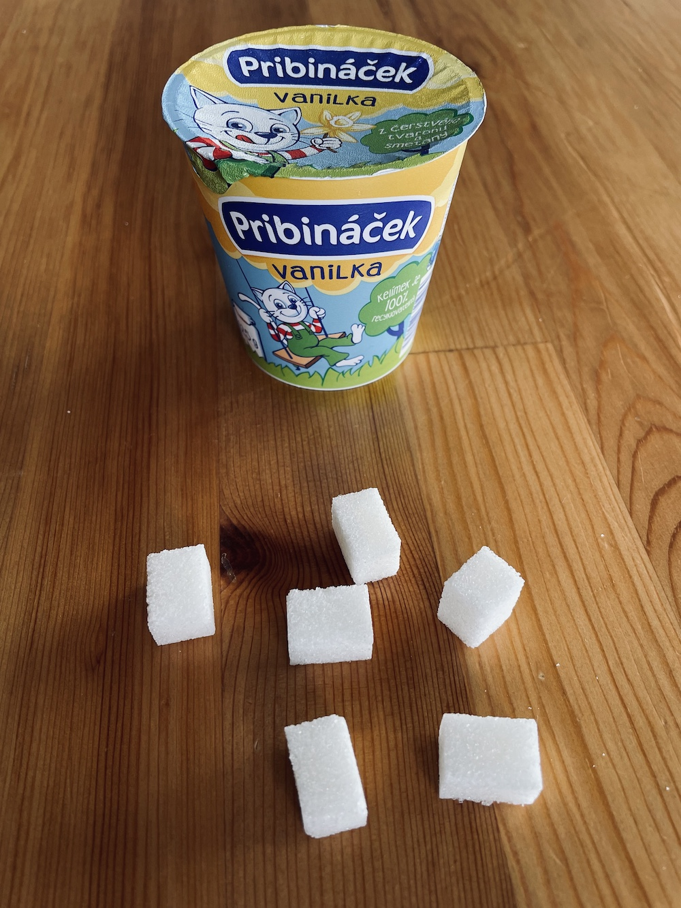

Kolik se v čem schovává cukru? Kolik ho sníte běžně za celý den? Kolik ho obsahuje svíčková nebo dětské svačinky? Pojďte se podívat. Kostka cukru váží 3g.

1. Pribináček vanilka = 17,5g cukrů = 6 kostek cukru
