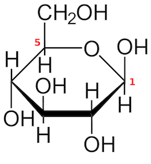
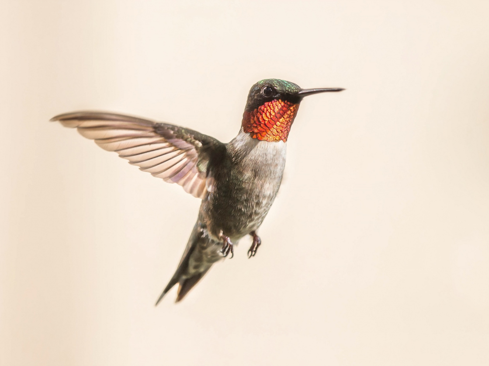

Glukóza a fruktóza jsou dva jednoduché cukry, které běžně jíme v naší stravě. Klasický bílý cukr, který používáte do vaření, pečení, do kafe, to je tzv. řepný cukr nebo sacharóza. U nás se vyrábí z cukrové řepy a ve světě z cukrové třtiny. Chemicky to je spojená dvojice glukózy a fruktózy, takže když sníte cukr, dostanete do sebe 50% glukózy a 50% fruktózy. Dalším hojně využívaným sladidlem je glukózo-fruktózový sirup, který je velmi oblíbený hlavně v USA. U nás ho najdete ve slazených nápojích, v ochucených mléčných výrobcích a ve sladkém baleném pečivu. Glukózo-fruktózový sirup se vyrábí z obilovin nebo z kukuřice a stal se oblíbený hlavně proto, že je jeho výrobní proces levnější. Při výrobě sirupu se mění část glukózy na fruktózu a ve výsledku může obsahovat až 55% fruktózy. 



## Glukóza a fruktóza mají v těle jiný osud
Když sníte nějakou sladkost, dostane se vám do těla glukóza i fruktóza. Chemicky mají oba cukry stejný počet uhlíků, vodíků a kyslíku. Každý má ale jinou strukturu a hlavně jiný osud v těle. 

| Glukóza | Fruktóza |
| ------- | -------- |
| C6H12O6 | C6H12O6  |
|  |  |

Glukóza slouží hlavně jako zdroj energie. Pokud je dostupná, tak z ní buňka vyrábí energii a nebo si glukózu ukládá do zásoby ve formě glykogenu. Po naplnění glykogenových zásob se další nadbytek ukládá jako tuková zásoba. Fruktóza se dá také spálit na energii, ale převážně z ní vzniká tuk. Metabolismus fruktózy v těle totiž nemá narozdíl od glukózy kontrolní mechanismus a spouští se kaskáda reakcí, které vedou ke tvorbě tuku. 

*Pozn. podrobný popis rozdílu metabolismů glukózy a fruktózy najdete ve videu*
 

## Kolibřík rubínohrdlý
Fruktóza se v přírodě vyskytuje hlavně ve zralém sladkém ovoci. To zvířata konzumují v létě a na podzim, aby nabrala hmotnost ve formě tuku a přečkala zimu. Nádherným příkladem tohohle koloběhu je kolibřík. Je to ptáček, který má neuvěřitelně rychlý metabolismus a zajímavý životní cyklus. 

Jednou ročně absolvuje kolibřík rubínohrdlý přelet z Yucatánu přes Mexický záliv do Spojených států, což je trasa dlouhá přes 800 km a kolibříci ji absolvují na jeden zátah. Aby to přežili, musí se na to dopředu připravit a vytvořit si tukové zásoby, ze kterých během cesty čerpají. V období před přeletem konzumují kolibříci hlavně nektar. Nektar je rostlinná šťáva, která obsahuje velké množství sacharidů a kolibříci jsou díky ní schopni nabrat až 40% své hmotnosti navíc ve formě tuku. Z vysokosacharidové stravy si vytvoří tělesný tuk, který během své cesty spálí. 

## Jak je to s tím ovocem?
I když člověk není kolibřík, tento mechanismus je stejný. Ze stravy bohaté na sacharidy a především fruktózu se v našem těle tvoří tuk. Již jsme si řekli, že se fruktóza hojně vyskytuje ve zralém ovoci. Ale všeobecně se přece jíst ovoce doporučuje, tak jak to s ním tedy je? 
Jíst ovoce může být prospěšné, protože ovoce kromě cukrů obsahuje i spoustu jiných látek jako např. vitamíny, vlákninu. Ale tak jako u všeho platí, že 

> **"dose makes poison"**, což znamená, že **"dávka dělá jed"**. 

Nemůžete sníst 3 kila banánů nebo vypít litr džusu pod záštitou, že ovoce je zdravé. Když sníte celý plod, tělu dá víc času ho strávit a vstřebat z něj  cukry. To je rozdíl oproti džusům, u nichž tu dávku cukru dostane tělo naráz. Čím víc volně dostupné fruktózy do sebe najednou dostanete, tím víc tuku se z ní vytvoří. Důležité je jak množství, tak koncentrace v čase.

## Ukládáním tuku vzniká steatóza jater
Při časté a nadměrné konzumaci fruktózy se v játrech ukládá tuk a vzniká tzv. steatóza nebo taky ztučnění jater, anglicky fatty liver. Játra, která jsou plná tuku, nemohou pracovat tak, jak mají a rozvíjí se v nich inzulinová rezistence. Inzulinová rezistence znamená, že tělo nereaguje adekvátně na inzulin a slinivka břišní ho musí začít produkovat víc. Vyšší hladina inzulinu se nazývá hyperinsulinémie. Tento stav je společným jmenovatelem všech chronických onemocnění jako je např. cukrovka, hypertenze, Alzheimer, neplodnost, rakovina. Játra posílají tuk také dál do těla, kde se ukládá v tukové tkáni, ve svalech a postupně všude, kde se dá. Vzniká nadváha a obezita. 

## Co mám vyřadit z jídelníčku, pokud chci zhubnout?
Všeobecně se dá doporučit vyřadit veškeré zdroje koncentrované fruktózy, tzn.:
- slazené nápoje (Cola, Sprite, Fanta, limonády, ledové čaje...)
- džusy
- energeťáky
- sladkosti

## Zdroje
1. Kniha The Fat Switch, Richard J. Johnson 
1. [Metabolismus fruktózy](https://www.youtube.com/watch?v=dBnniua6-oM) - Sugar: The Bitter Truth, Robert H. Lustig, MD, UCSF Professor of Pediatrics in the Division of Endocrinology
1. [Metabolismus fruktózy ve střevě](https://www.sciencedirect.com/science/article/pii/S1550413117307295) - The Small Intestine Converts Dietary Fructose into Glucose and Organic Acids
1. [Střevní mikrobiom metabolizuje fruktózu na acetát](https://pubmed.ncbi.nlm.nih.gov/32214246/) - Dietary fructose feeds hepatic lipogenesis via microbiota-derived acetate
1. [Fruktóza je evoluční cesta k přežití období nedostatku](https://www.researchgate.net/profile/Miguel-Lanaspa/publication/336624324_Fructose_Metabolism_as_a_Common_Evolutionary_Pathway_of_Survival_associated_with_climate_change_food_shortage_and_droughts/links/5f1907bf299bf1720d5c974c/Fructose-Metabolism-as-a-Common-Evolutionary-Pathway-of-Survival-associated-with-climate-change-food-shortage-and-droughts.pdf?origin=publication_detail) - Fructose Metabolism as a Common Evolutionary Pathway of Survival associated with climate change, food shortage and droughts
1. [Záleží na koncentraci v čase](https://www.mdpi.com/2072-6643/13/6/1916) - The Speed of Ingestion of a Sugary Beverage Has an Effect on the Acute Metabolic Response to Fructose
1. [Kyselina močová](https://pubmed.ncbi.nlm.nih.gov/23112875/) - Uric acid stimulates fructokinase and accelerates fructose metabolism in the development of fatty liver
1. [Kolibřík](https://www.ncbi.nlm.nih.gov/pmc/articles/PMC1325055/) - Adipose energy stores, physical work, and the metabolic syndrome: lessons from hummingbirds
1. [Transplantace jater v USA](https://journals.lww.com/ajg/Abstract/2018/11000/NASH_Leading_Cause_of_Liver_Transplant_in_Women_.20.aspx) - NASH Leading Cause of Liver Transplant in Women: Updated Analysis of Indications For Liver Transplant and Ethnic and Gender Variances

