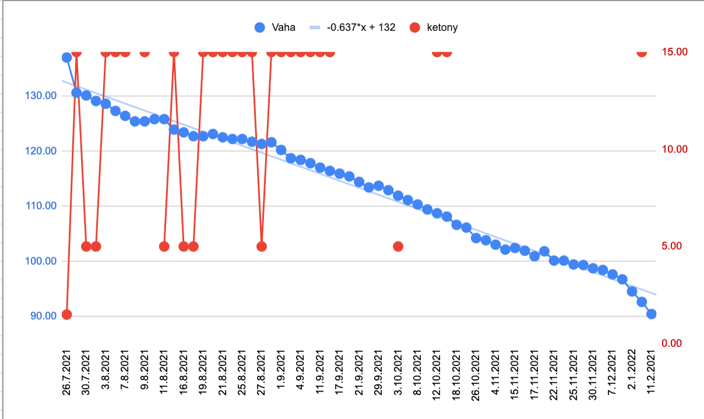

Udržet rovnováhu mezi prací a soukromým životem je těžký. Jako vývojář sedím na zadku skoro celý den. Zkoušel jsem cvičit, ale stejně jsem se postupně dopracoval k obezitě. Později jsem zhubl 47 kg a teď si váhu držím stabilní již několik let. V technické komunitě se řeší jen "technologické zázraky" roku. Každý rok přijde nový hit. Ale jen málokdo řeší téma zdraví. A přitom se to týká každého z nás. Možná přišel ten správný čas začít vnímat i tuto stránku. Zde sdílím svůj příběh a úskalí, která jsem musel překonat.

Celý život jsem byl při těle. Už dávno jsem nadváhu přijal jako součást své identity. Nedokázal jsem zhubnout ani cvičením, a to jsem trávil většinu volného času venku běháním za míčem. Celou školu jsem měl nadváhu a nemohl si koupit pěkné oblečení. Nebyl jsem totiž konfekční typ. Tohle ale není příběh o tom, jak těžké to tehdy bylo. Asi si to umíte představit. Byl jsem terčem šikany, xenofobie, ukazování prstem s minimální podporou rodiny, protože můj otec chtěl štíhlého fotbalového syna, kterým jsem nikdy nemohl být. Dnes chci ale psát hlavně o tom, jak jsem se dostal z obezity, jak jsem konečně zhubl 50 kg a váhu si udržel. Tento příběh pro vás může být inspirativní, pokud chcete sami zhubnout, znáte někoho, kdo bojuje s váhou, diabetem, vysokým cholesterolem nebo jste prostě jen zvědaví. Ať tak či onak, moje cesta mě přesvědčila, že udržení váhy je téma pro každého. Obezita a diabetes 2. typu jsou tak rozšířené, že se vám dříve či později může stát, že vám lékař řekne, že musíte zhubnout, protože jste na dobré cestě zemřít na infarkt. (Pokud ne, budete jeden z mála šťastných s vhodnými geny).

Totéž se mi stalo před lety, když jsem navštívil svého lékaře. Byl jsem obézní, nezadaný programátor, který trávil příliš mnoho času v práci. Seděl na židli, pil energetické nápoje, jedl svačiny a pil litry kávy s mlékem. Byl jsem workoholik. Strávil jsem skoro celý den v práci kódováním nebo studováním, jak dělat svou práci co nejlépe. Vždy jsem měl radost, když mě mí starší kolegové pochválili za skvělou práci. Byl jsem na nejlepší cestě k vyhoření. A ano, vyhořel jsem.

Ke změně došlo jednou v noci, kdy jsem doma pracoval na hobby projektu. V té době jsem vydržel pracovat celý den v práci, pak jít domů a pokračovat v práci přes noc. O půlnoci jsem jedl svou druhou pozdní večeři. Nepřetržité přemýšlení vyžaduje kalorie. A tak jsem jedl a jedl... Seděl jsem za stolem a najednou jsem se podíval dolů na svoje břicho. Viděl jsem jen obézní tělo a začal jsem se divit, jak jsem to dopracoval až takhle daleko. Vždycky jsem byl oplácaný, ale ne obézní. V tu chvíli jsem se rozhodl, že problém s váhou je skutečný problém.

Začal jsem se zlatým standardem hubnutí - „jíst míň a hýbat se víc“. Vybral jsem si plavání, protože pro jinou aktivitu jsem byl příliš obézní. Začal jsem plavat každý druhý den 1 hodinu. Odhodlání nikdy nebyl můj problém. Boj se šikanou ve škole mě udělal docela odolným. Pokud považuji něco za problém, vždy se ho snažím vyřešit co nejlépe. Po nějaké době mi jednoho dne ráno při oblékání spadly kalhoty a já si všiml své první viditelné změny.

O pár kilo lehčí jsem konečně mohl začít dělat i jiné sporty. Přidal jsem tedy běhání. Nemám rád sprinty, ale mojí zálibou se staly vytrvalostní běhy. Začal jsem pomalu během na 3km, pak 4km a nakonec jsem po pár měsících běhal pravidelně 8km. Zároveň jsem pokračoval i v plavání. Bylo to vlastně velmi efektivní kombo a moje hubnutí začalo být velmi, ale VELMI vidět.
</figure>
  
  <figcaption>
    Moje staré pyžamové kalhoty skončily jako hadr na podlahu
  </figcaption>
</figure>
Dostal jsem se do nejlepší fyzické formy svého života. Pravidelný sport měl dopad i na můj pracovní režim. Omezil jsem práci v noci, protože se změnila moje motivace. Zlepšil se mi spánek.Začal jsem být plný energie. Neměl jsem chuť na cukr, na energeťáky ani na kávu. Napumpovalo mě to motivací a začal jsem se dokonce účastnit organizovaných běžeckých závodů. Začal jsem mít také problém s oblečením (ten příjemnější). Z upnutého XXL jsem přešel na velmi pohodlné L. Cítil jsem, že jsem "zpět"... Konečně.

Pokud bychom skončili tady, byla by to jen polovina příběhu. Příběhu mnoha lidí, kterých každý přečetl za život už hodně. Ale tohle je pouze začátek. Život je mnohem složitější, přináší nám nové a nové zkoušky a já jsem to poznal velice brzy. 

> Zhubnout je snadné, opravdové umění je váhu si udržet.

Moje váhová horská dráha začala jednoduše. Zamiloval jsem se ❤...

Když je člověk zamilovaný, není neobvyklé, že se mu změní priority. A přesně to se stalo i mně. Můj spartánský život skončil. Začal jsem řešit jiné naléhavější záležitosti. Vždy bylo něco důležitějšího, než jít běhat. Chtěl jsem trávit co nejvíce času se svou ženou, dělat běžné věci jako sledovat filmy, jít na společnou večeři, navštěvovat rodinné příslušníky a přátele, prostě užívat si společný čas. Přestěhovali jsme se na nové místo a začali spolu žít. Časem se nám narodily dvě úžasné děti. Moje pravidelné sportovní návyky byly ty tam. Úplně jsem to nevzdal, chodil jsem plavat do místního bazénu a začal jsem běhat po okolních kopcích. Ale bylo to velmi sporadicky ve srovnání s téměř každodenním sportováním dříve a já se začal opět zakulacovat. Myslel jsem a stále si myslím, že to byl dobrý kompromis. Na výchovu dětí jsou potřeba dva dospělí lidé a já jsem v tom nechtěl nechat svoji ženu samotnou.

Posledním hřebíčkem do rakve ale byla pandemie COVID-19. Pracoval jsem z domu, nikam jsem nechodil. Moje váha začala rapidně stoupat, až jsem se dostal znovu nad 130 kilo. Můj trik s plaváním nebyl možný, protože vše bylo zavřené a na běhání jsem už byl opět příliš těžký. Zkoušel jsem se svojí ženou cvičit jógu, ale nešlo mi to a brzy jsem přestal. Jóga je pro obézního člověka ve skutečnosti velmi těžká.

Později jsem s nevolí musel sundat z půdy své staré nadměrné oblečení a místo něj dát zpátky do krabice své štíhlé košile  se zasténáním, že si je jednoho dne vezmu zpět. Cítil jsem tehdy naprosté selhání... Věděl jsem, že potřebuji zhubnout, něco změnit, ale v tu chvíli jsem nevěděl, kde začít. Jako mnoho obézních lidí i já jsem byl bezradný. Měl jsem odhodlání, ale cítil jsem se úplně bezmocný.
<figure>
   
  <figcaption>
    já, s víc jak 130kg
  </figcaption>
</figure>

Pak se stalo něco naprosto neočekávaného... Měl jsem jednoduše štěstí...

Algoritmus youtubu mi ukázal video amerického doktora Dr. Pradipa Jamnadase, jak přednáší o přerušovaném půstu a ketogenní dietě. Stručně řečeno, jeho rada byla jíst jednou denně nízkosacharidovou stravu zaměřenou na tvorbu ketolátek. Měla by vám pomoci snížit váhu pouze změnou toho co jíte. Pomyslel jsem si, že to byl určitě  šarlatán. Přesto mě zaujalo, že ketony je možné změřit v ranní moči. Stačí si koupit močový proužek v lékárně. Tak jsem to zkusil. Koupil jsem si proužky a začal jíst  jednou denně (pro začátek jsem nasadil konfitovanou kachnu :)). Druhý den ráno jsem odebral vzorek moči a změřil jsem slušné množství ketonů.
</igure>
  
  <figcaption>
    Měřící proužek, fialově zbarvené políčko znamená zvýšené množství ketolátek.
  </figcaption>
</figure>

Fungovalo to! Byl jsem opravdu ohromen tímto malým úspěchem. Nakoplo mě to pokračovat v jídle jednou denně i dál. Netušil jsem, kam až mě tahle cesta dovede. Pokračoval jsem v přerušovaném půstu dalších 7 měsíců a zhubl jsem 50 kg. Bez těžkého tréninku, bez chození do fitka, které bylo kvůli pandemii zavřené. Většinu času jsem seděl na židli v domácí kanceláři a jedinou fyzickou aktivitou byla práce na zahradě. Přesto šla ručička na váze stále dolů. Fungovalo to perfektně.

....

Má to nějaké pokračování? Vlastně ... ano.

Celý proces s hubnutím mě natolik fascinoval, že jsem všechen svůj čas během covidu trávil hledáním odpovědi na otázku, jak to celé funguje. Brzy se k bádání připojila i moje žena lékařka, kterou mé úspěchy také ohromily a po večerech jsme začali spolu řešit biochemii a fyziologii člověka. Na medicíně se totiž výživě v hodinách moc času nevěnovalo. I váš praktik nemusí vědět víc než dobře míněnou, ale nedostatečnou radu - "měl byste trošku zhubnout".  Přečetli jsme hodně vědeckých studií. Většina článků o výživě je současný výzkum, protože téma výživy se stalo v poslední době velmi populární. O půstu už toho dnes víme mnoho a je za ním víc než pouze hlad. Jedním z efektů je, že vaše tělo sníží sekreci ghrelinu a neuropeptidu Y, což vede k menšímu hladu, menší chuti k jídlu a nižšímu příjmu kalorií. Druhým je, že během ketogenní diety hladina inzulinu klesne na úroveň, kdy vaše tělo začne preferovat spalování tuků před vším ostatním a nízké výkyvy inzulinu potlačují touhu po jídle. To je velmi výhodné, pokud chcete efektivně zhubnout 50 kg a vydržet to!

<figure>
  
  <figcaption>
    Modré tečky - moje váha. Kalorická restrikce (jíst jednou denně, do zasycení) a ketogenní dieta fungovaly. Červené tečky - ketolátky. Měřil jsem téměř každý den.
  </figcaption>
</figure>

Standardní západní strava je na druhou stranu plná sacharidů. Sacharidy se přidávají téměř všude. Pokud se nedíváte na etikety potravin, můžete být překvapeni, kolik přidaného cukru denně sníte. Kolik kalorií obsahují chipsy a ořechy. Cvičením je spálíte, ale pokud přestanete cvičit a budete mít vyšší kalorický příjem, začnete zase nabírat. 

To samé se mi stalo před lety. Byl jsem nepřipravený a moc jsem toho o výživě nevěděl. Co jsou to kalorie? Je nějaký rozdíl v metabolismu cukrů, tuků a bílkovin? Může jídlo naprogramovat vaše geny tak, aby podpořily lipogenezi v játrech? Co přesně se děje ve vašem těle po jídle? Jak sestavit svůj rozvrh, abyste si udrželi váhu po dlouhou dobu? Jak nastavit svou mysl, aby odolala obezitogennímu prostředí, ve kterém žijeme? Jak efektivně zhubnout – abyste si váhu skutečně udrželi roky? 

> Odpověď je hlubší než chybějící znalosti v biochemii. Je to i sociální problém. 

Je velmi těžké odolat jídlu, protože jídlo i reklama na něj je všude kolem nás. Jsme zvyklí se jídlem uklidňovat i odměňovat. To vše může vést k začarovanému kruhu "jsem ve stresu -> jím -> jsem ve stresu, protože zajídám stres a mám výčitky/protože mám nadváhu a neměla/a bych tolik jíst -> opět jím".

S mojí ženou jsme si uvědomili, že odpovědi na to, jak efektivně řídit váhu, chceme sdílet. Dobré věci se musí šířit (všechny materiály/videa jsou zdarma, jako open source / open science)... Spustili jsme Youtube kanál - Metabolický řidičák s obsahem, kde sdílíme naše zkušenosti a to, co jsme se dozvěděli o dietách a o jídle. Svoji váhu řeší každý. Vidíme kolem sebe mnoho lidí trpících nadváhou, kterým to ovlivňuje psychický stav. Většina z nich je bezradná, jak vlastně začít. Jaké jídlo  vařit. Co a jak jíst. Kanál obsahuje krátká videa s recepty, videa s detaily o metabolismu, recenze diet (které jsme testovali) a naše vlastní úskalí, která mohou pomoci přesvědčit diváky, že 

> příliš vysoká váha je problém, na který by se mělo účinně zacílit.

Příkladem může být moje maminka s prediabetem, která už zhubla 14 kg. Dokázala změnit jídelníček, i když je ve vztahu k jídlu konzervativní. Dělala to postupně a zjistila, jaká dieta jí funguje nejlíp. Přizpůsobila dietu sobě a ne naopak - aby své dietě podřídila vše ostatní. Nyní si najde čas i na pravidelné cvičení!

V mém případě byla klíčová změna stravy - přechod na ketodietu, vysazení alkoholu a přerušovaný půst (OMAD = one meal a day). Je mi jasné, že vás teď možná napadlo, že dneska zase skončíte na veřeči v mekáči, že jíst jednou denně je nesmysl a vysazení alkoholu je nemožné. Vždyť potřebujete nějakej antistres. Ale cílem není sebetrýzeň, ale vytvoření si dobrého vztahu k jídlu a k sobě samým. Nemusí to mít pro všechny stejnou formu, jako jsem měl já. Ale věřte mi, že postupně se to dá.

Moje cesta mě přesvědčila, že i naši slabinu lze proměnit ve výhodu. Jo, může to nějakou dobu trvat. Bude to trvat. Můžeme se točit v kruzích, ale to je normální. Jsme jen lidé. Neexistuje žádná nejlepší dieta a všechny „dobré rady“ je třeba upravit podle konkrétního kontextu. Podle preferencí, životního stylu a limitů každého. Jedině tak to bude účinné. Když se krátkodobá dieta změní na dlouhodobý návyk. Když začneme brát dobré jídlo jako důležitou součást našeho života a vybudujeme si k němu zdravý vztah.

Hodně sil všem, co někdy začnou s hubnutím....

Moje cesta pokračuje dál... ⛵

Peter

<figure>
  
  <figcaption>
   Jsem zpátky a opět běhám! S mojí dcerou Eliškou.
  </figcaption>
</figure>