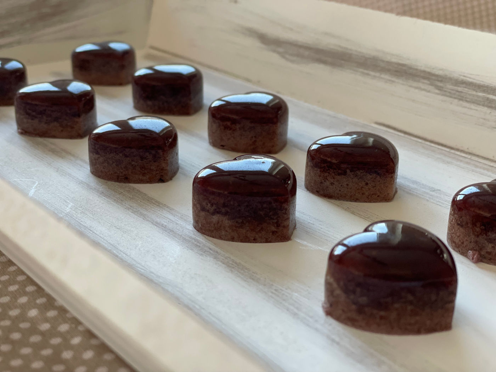

Udělejte dětem domácí ovocné želé bonbóny jen z pár ingrediencí a bez přidaných chemických látek! Jsou paleo a AIP friendly a můžete si vybrat jakou příchuť chcete!



## Ingredience
- 1,5 hrnku ovoce
- 1 hrnek vody s limetkou (lze použít i samotnou limetkovou šťávu nebo jakýkoliv džus)
- 3 lžíce medu
- 0,5 hrnku želatiny

## Postup
V mixéru rozmixujeme ovoce, zvolenou tekutinu a med. Směs přelijeme do hrnce, přisypeme želatinu a za stálého míchání zahříváme na mírném ohni do zhoustnutí. Hustou směsí ihned naplníme formičku (pokud nemáte formičku, lze vyložit pečícím papírem plech, směs na to vylít a následně rozkrájet na kostičky) a umístíme alespoň na hodinu do lednice. Uchovávejte v lednici.

## Tipy
Já používám jako tekutinu vodu s trochou limetky, protože nám kyselé věci a citrusy vadí zdravotně. Pokud s tí vy nemáte problém, vyzkoušejte dát pouze limetku nebo džus, bonbóny budou perfektně kyselé.

