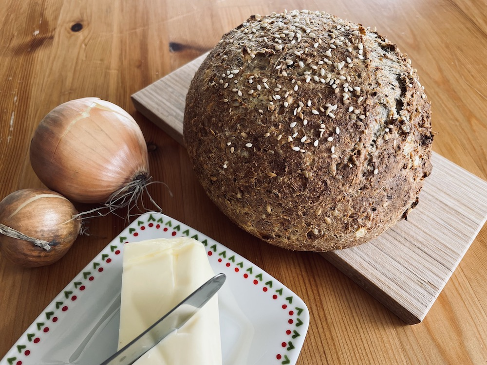

Vyzkoušejte tento keto chlebík z balkánského sýru! Nejlepší je hned z trouby jenom s máslem. Je lowcarb, bez lepku a plný vlákniny.



## Ingredience
- 4 PL mandlové mouky
- 4 PL psyllia
- 4 PL lněné mouky
- 2 lžičky kmínu
- ½ sáčku prášku do pečiva
- 4 hrsti semínek - slunečnicová, lněná, sezamová, chia...
- 200g balkánského sýru
- 5 vajec
- 2 střední cibule
- 1 stroužek česneku

## Postup
V kuchyňském robotu rozmixujeme společně balkánský sýr, vejce, cibuli, česnek a semínka. Zbytek sypkých surovin pořádně promícháme v míse a přidáme tekutou směs. Vytvoříme tužší těsto a rukama vytvarujeme bochník. Chléb po straně nařízneme ostrým nožem a posypeme semínky. Pečeme zhruba hodinu na 180 stupňů. Sůl není do těsta potřeba, protože balkánský sýr je dostatečně slaný. 

