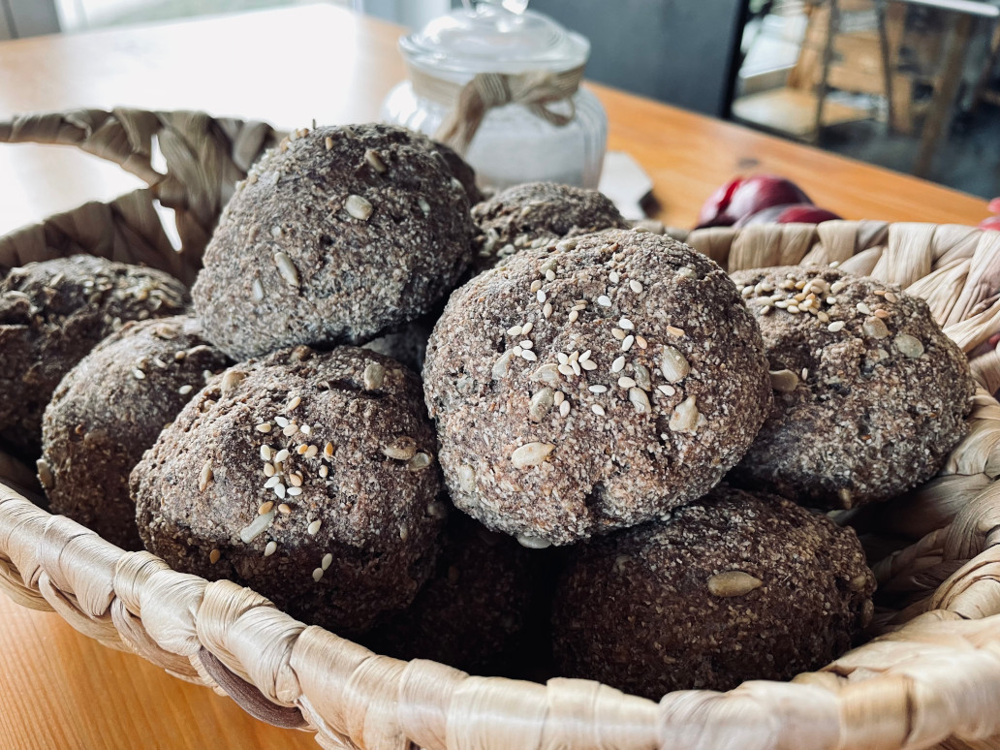

Upečte si doma ketobulky z mandlové mouky! Jsou vhodné při lowcarb a keto stravování, jsou vegan, bez lepku a skvěle zastoupí pečivo z bílé mouky. 



## Ingredience (12 bulek)
- 280g mandlové mouky
- 100g psyllia
- 70g lněné mouky
- 2 hrsti slunečnicových semínek (možno přidat jakékoliv)
- 2 lžičky soli
- 2 lžičky drceného kmínu
- 2 lžičky sušené cibule
- 1 kypřící prášek do pečiva
- 500ml teplé vody
- 4 lžičky jablečného octa

## Postup
Všechny suché ingredience přidáme do velké mísy a pořádně promícháme. Do teplé vody přidáme jablečný ocet a přilijeme do sypké směsi. Rukama uhněteme tuhé těsto a vytvarujeme cca 12 ketobulek. Posypeme sezamovým semínkem a pečeme v troubě na 180 stupňů zhruba 45 minut. 

## Varianty
- můžete experimentovat s kořením, vyzkoušejte třeba římský kmín
- karamelizovanou cibuli
- škvarky

## Tipy
- upečené ketobulky uchovávejte v lednici, vydrží déle

