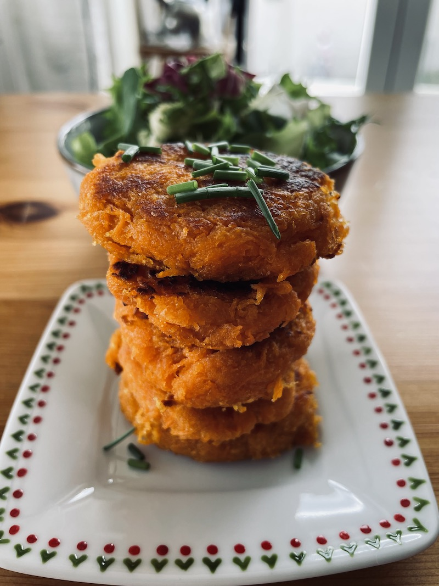

Vyzkoušejte tyto jednoduché batátové placičky jenom ze 3 ingeridencí! Dají se jíst jako příloha nebo jen tak se salátem a dobrým dipem k večeři. Batáty jsou bohaté na vitamíny, minerály, vlákninu a antioxidanty a v kuchyni se s nimi dají dělat vyloženě divy!

odkaz na video

## Ingredience (cca 20 placiček)
- 2 větší batáty (cca 1kg)
- 100g tapiokového škrobu (dá se použít i arrowroot, bramborový škrob)
- 2 lžičky soli
- kokosový olej na smažení

## Postup
Batáty oškrábeme a najemno nastrouháme. Poté z nich pořádně vymačkáme co nejvíc šťávy. Pozor, šťávu nemusíte vylévat, ale můžete ji vypít nebo použít třeba do zálivky na salát, je totiž obrovským zdrojem vlákniny a vitamínů! Do vymačkaných batátů přisypeme škrob a sůl a pořádně promícháme. Poté rukama vytvarujeme placičky. Na rozpálenou pánev dáme rozehřát kokosový olej a placičky opékáme z obou stran do zlatova. Podáváme jako přílohu nebo se salátem nebo jakkoliv máte chuť.

## Tipy
- do placiček můžete přidat česnek, bylinky, lahůdkové droždí…

