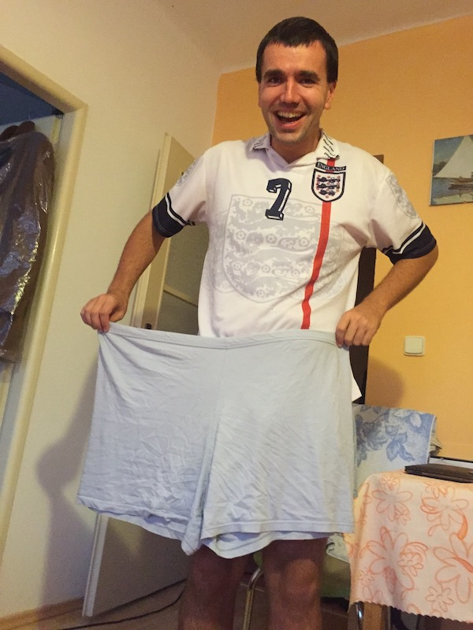
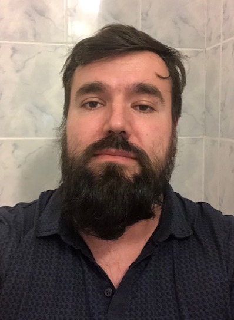
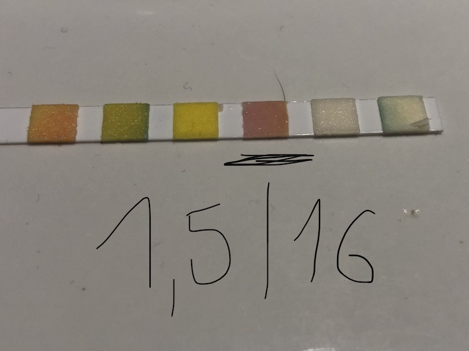
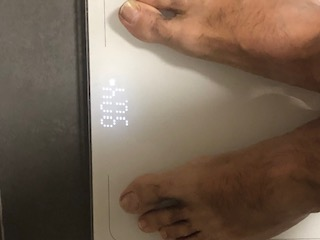
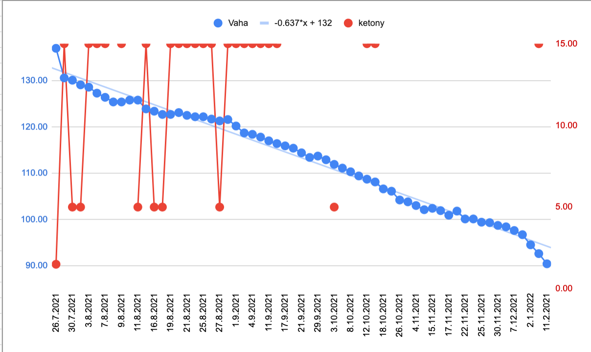
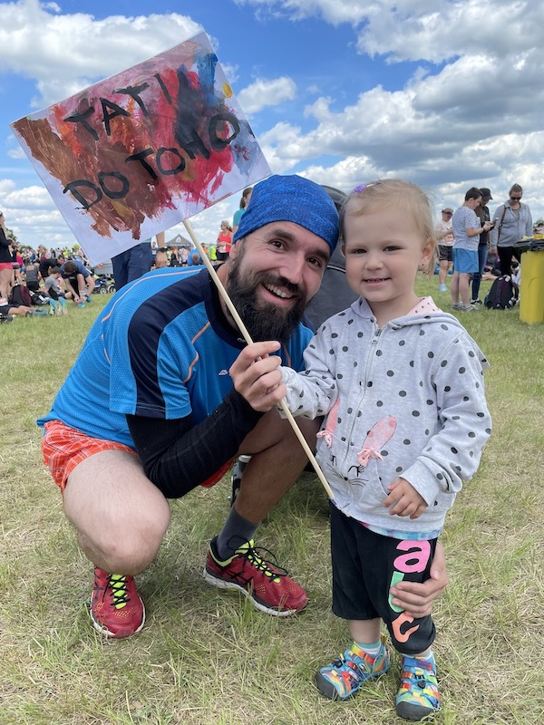

Udržet rovnováhu mezi prací a soukromým životem je težký. Jako vývojář sedím skoro celý den. Zkoušel jsem cvičit, ale místo toho jsem se dopracoval k obezitě. Později jsem zhubl 47 kg a teď si váhu udržuji stabilní již několik let. V technické komunitě se hodně mluví o "technologickém zázraku" roku. Každý rok přijde nový hit. Ale jen málo se řeší téma zdraví. Možná přišel ten správný čas začít vnímat i jiný úhel pohledu. Zde sdílím svůj příběh a úskalí, která jsem musel překonat.

Celý život jsem byl při těle. Už dávno jsem nadváhu přijal jako součást své identity. Nedokázal jsem zhubnout ani cvičením, a to jsem trávil většinu volného času venku utíkáním za míčem. Celou školu jsem měl nadváhu a nemohl jsem si koupit pěkné oblečení. Nebyl jsem totiž konfekční typ. Ale tohle není příběh o tom, jak těžké to tehdy bylo. Můžete si představit... Byl jsem terčem šikany, misogynie, ukazování prstů a minimální podpory ze strany rodiny, protože můj otec chtěl štíhlého fotbalového syna, kterým jsem nikdy nemohl být. Ne, tohle je příběh o tom, jak jsem se dostal z obezity, jak konečně zhubnout 50 kg a udržet si váhu i nadále. Tento příběh pro vás může být inspirativní, pokud chcete zhubnout nebo znáte někoho, kdo bojuje s váhou, diabetem, vysokým cholesterolem nebo jste prostě jen zvědaví. Ať tak či onak, moje cesta mě přesvědčila, že udržení váhy je téma pro každého. Obezita a diabetes 2. typu je tak rozšířený, že se vám brzy nebo později stane, že vám lékař řekne, že musíte zhubnout, protože jste na dobré cestě zemřít na infarkt. (Pokud ne, budete jeden z mála, šťastných, s vhodnými geny).

Totéž se mi stalo před lety, když jsem navštívil svého lékaře. Byl jsem obézní, nezadaný programátor, který trávil příliš mnoho času v práci. Seděl na židli, pil energetické nápoje, jedl svačiny a litry kávy s mlékem. Byl jsem workoholik. Strávil jsem skoro celý den v práci kódováním nebo studováním, jak dělat svou práci lépe. Vždy jsem měl radost, když mě mí starší kolegové pochválili za skvělou práci. Byl jsem ukázkovým materiálem k vyhoření. A ano, vyhořel jsem.

Ke změně došlo jednou v noci, kdy jsem doma pracoval na hobby projektu. V té době jsem vydržel pracovat celý den v práci, pak jít domů a pokračovat v práci přes noc. O půlnoci jsem jedl svou druhou pozdní večeři. Nepřetržité přemýšlení vyžaduje kalorie. A tak jsem jedl a jedl... Seděl jsem za stolem a najednou jsem se podíval dolů na svoje břicho. Viděl jsem jen obézní tělo a začal jsem se divit, jak jsem to dopracoval až takhle daleko. Vždycky jsem byl oplácaný, ale ne obézní. V tu chvíli jsem se rozhodl, že problém s váhou je skutečný problém.

Začal jsem se zlatým standardem hubnutí - „jíst míň a víc se hýbej“. Vybral jsem si plavání na 1 hodinu. Byl jsem příliš obézní na to, abych dělal cokoliv jiného. Začal jsem plavat každý druhý den. Odhodlání nikdy nebyl můj problém. Boj se šikanou ve škole mě udělal docela odolným. Pokud považuji něco za problém, vždy se ho snažím vyřešit co nejlépe. Při tak častém cvičení mi jednoho dne ráno při oblíkání spadly kalhoty a já si všiml své první viditelné změny.

S pár kily dolů jsem konečně mohl začít dělat i jiné sporty. Přidal jsem tedy běhání. Nemám rád sprinty. Mojí zálibou se staly vytrvalostní běhy. Začal jsem pomalu 3km, 4km a skončil jsem po pár měsících na pravidelném běhání 8km. Pokračoval jsem i v plavání. Bylo to vlastně velmi efektivní kombo a moje hubnutí začalo být velmi, ale VELMI vidět.
</figure>
  
  <figcaption>
    Moje staré pyžamové kalhoty skončily jako hadr na podlahu
  </figcaption>
</figure>
Dostal jsem se do nejlepší fyzické formy svého života. Pravidelný sport měl dopad i na můj pracovní režim. Omezil jsem práci v noci, protože se změnila moje motivace. Zlepšil se mi spánek.Začal jsem být plný energie. Neměl jsem chuť na cukr, na energetické nápoje ani na kávu. Napumpovalo mě to motivací a začal jsem se dokonce účastnit organizovaných běžeckých závodů. Začal jsem mít také problém s oblečením (ten příjemnější). Z upnutého XXL jsem přešel na velmi pohodlné L. Cítil jsem, že jsem "zpět"... Konečně.

Pokud bychom skončili tady, byla by to jen polovina příběhu a vyznělo by to jako návnada na bulvární článek. Život je mnohem složitější a přináší nám nové a nové zkoušky. Poznal jsem to velice brzy. 

> Zhubnout je snadné, opravdové umění je váhu si udržet.

Moje váhová horská dráha začala jednoduše. Zamiloval jsem se ❤...

Když je člověk zamilovaný, není neobvyklé, že se mu změní priority. A přesně to se stalo i mně. Můj spartánský život skončil. Začal jsem řešit jiné naléhavější záležitosti. Vždy bylo něco důležitějšího, než jít běhat. Chtěl jsem trávit co nejvíce času se svou ženou, abych mohl dělat běžné věci jako sledovat filmy, jít na společnou večeři, navštěvovat rodinné příslušníky a přátele, prostě užívat si společný čas. Přestěhovali jsme se na nové místo a začali spolu žít. Časem se nám narodily dvě úžasné děti. Moje pravidelné sportovní návyky byly ty tam. Úplně jsem to nevzdal, chodil jsem plavat do místního bazénu a začal jsem běhat po okolních kopcích. Ale bylo to velmi sporadicky ve srovnání s téměř každodenním sportováním dříve a já se začal opět zakulacovat. Myslel jsem a stále si myslím, že to byl dobrý kompromis. Na výchovu dětí jsou potřeba dva dospělí lidé a nenechal jsem v tom svoji ženu osamotě. Tak to tátové dělají.

Posledním hřebíčkem do rakve ale byla pandemie COVID-19. Pracoval jsem z domu, nikam jsem nechodil. Moje váha začala rapidně stoupat, až jsem se dostal znovu nad 130 kilo. Můj trik s plaváním nebyl možný, protože vše bylo zavřené a na běhání jsem už byl příliš těžký. Zkoušel jsem cvičit jógu se svojí ženou. Byl jsem ale tak obézní, že mi to vůbec nešlo a brzy jsem přestal. Jóga pro obézního člověka je ve skutečnosti velmi těžká.

Později jsem s nevolí musel vybrat ze staré krabice své staré nadměrné oblečení a dát své štíhlé košile zpět do krabice se zasténáním, že si je jednoho dne vezmu zpět. Cítil jsem se jako naprosté selhání... Věděl jsem, že potřebuji zhubnout, něco změnit, ale v tu chvíli jsem nevěděl, kde začít. Jako mnoho obézních lidí i já jsem byl bezradný. Měl jsem odhodlání, ale cítil jsem se úplně bezmocný.
<figure>
   
  <figcaption>
    já, s víc jak 130kg
  </figcaption>
</figure>

Pak se stalo něco naprosto neočekávaného... Měl jsem jednoduše štěstí...

Algoritmus youtubu mi ukázal video amerického doktora Dr. Pradipa Jamnadase, jak přednáší o přerušovaném půstu a ketogenní dietě. Stručně řečeno, jeho rada byla jíst jednou denně dietu specificky zaměřenou na tvorbu ketolátek, nízkosacharidovou dietu. Měla by vám pomoci snížit váhu pouze změnou toho co jíte. Určitě to byl šarlatán, pomyslel jsem si. Přesto mě zaujalo, že ketony je možné změřit v ranní moči. Stačí si koupit močový proužek v lékárně. Tak jsem to zkusil. Koupil jsem si proužek a jedl jednou denně (pro začátek jsem nasadil konfitovanou kachnu :)). Druhý den ráno jsem odebral vzorek moči a změřil jsem slušné množství ketonů.
</igure>
  
  <figcaption>
    Měřící proužek, fialově zbarvené políčko znamená zvýšené množství ketolátek.
  </figcaption>
</figure>

Fungovalo to! Byl jsem tak ohromen tímto malým úspěchem. Nakoplo mě to pokračovat v jídle jednou denně po další měsíce. Nevěděl jsem, kam až mě tahle cesta dovede. Pokračoval jsem v půstu dalších 7 měsíců a zhubl jsem 50 kg. Bez těžkého tréninku, bez chození do fitka (zavřeno kvůli pandemii). Většinou jsem seděl na židli v domácí kanceláři a pracoval na zahradě. Stále jsem hubl. Výborně to zapadlo do toho, co jsem mohl dělat během covidu. Fungovalo to perfektně.

....

Má to nějaké pokračování? Vlastně ... ano.

Byl jsem tak ohromen, jak je to možné, že jsem všechen svůj čas během covidu strávil otázkou, proč a jak je tohle možné. Moje žena se také připojila k hledáni. Je to lékařka a byla také hodně překvapená. V době, kdy studovala univerzitu, se výživě v hodinách moc času nevěnovalo. A i váš praktik, kterého navštěvujete, nemusí vědět víc než dobrou, ale nedostatočnou radu - "zhubněte".  Přečetli jsme hodně vědeckých studií. Většina článků o výživě je současný výzkum. Téma výživy se stalo v poslední době velmi populární. O půstu je dnes již vyzkoumáno mnoho a je za tím víc než pouze hlad. Jedním z efektů je, že vaše tělo sníží sekreci ghrelinu a neuropeptidu Y, což vede k menšímu hladu, menší chuti k jídlu a nižšímu příjmu kalorií. Druhým je, že během ketogenní diety hladina inzulinu klesne na úroveň, kdy vaše tělo začne preferovat spalování tuků před vším ostatním. Nízké výkyvy inzulinu potlačují touhu po jídle. Velmi výhodné, když chcete efektivně zhubnout 50 kg a vydržet to!

<figure>
  
  <figcaption>
    Modré tečky - moje váha. Kalorická restrikce (jíst jednou denně, do zasycení) a ketogenní dieta udělaly ten rozdíl. Červené tečky - ketolátky. Měřil jsem téměř každý den.
  </figcaption>
</figure>

Na druhou stranu standardní západní strava je plná sacharidů. Sacharidy se přidávají téměř všude. Pokud se nedíváte na etikety potravin, můžete být překvapeni, kolik přidaného cukru denně sníte. Kolik kalorií obsahují chipsy a ořechy. Při častém tréninku je spálíte, ale počítejte s jojo efektem, když přestanete.

To samé se mi stalo před lety. Byl jsem nepřipravený a nevěděl jsem o mnoha podrobnostech týkajících se výživy. Co jsou to kalorie? Je nějaký rozdíl v metabolismu cukrů, tuků a bílkovin? Může jídlo naprogramovat vaše geny tak, aby podpořily lipogenezi v játrech? Co přesně se děje ve vašem těle po jídle? Jak sestavit svůj rozvrh, abyste si udrželi váhu po dlouhou dobu? Jak nastavit svou mysl, aby odolala obezitogennímu prostředí, ve kterém žijeme? Jak efektivně zhubnout – abyste si váhu skutečně udrželi roky? 

> Odpověď je hlubší než chybějící znalosti v biochemii. Je to i sociální problém. 

Je velmi těžké odolat jídlu. Reklama na jídlo je všude. Jsme také zvyklí zklidňovat stres jídlem. To vše může vést k začarovanému kruhu "ve stresu -> jíme -> být ve stresu z jídla -> opět jíme".

S mojí ženou jsme si uvědomili, že odpovědi na to, jak efektivně řídit váhu, je skvělý obsah ke sdílení. Dobré věci se musí šířit (všechny materiály/videa jsou zdarma, jako open source / open science)... Spustili jsme Youtube kanál - Metabolický řidičák s obsahem, kde sdílíme to, co jsme se dozvěděli o dietách. Svoji váhu řeší každý. Vidíme kolem sebe mnoho lidí trpících cukrovkou, obezitou, vysokým cholesterolem. Bez dobrého způsobu, jak vlastně začít. Jaké jídlo vlastně vařit. Co je potřeba pro efektivní půst? Kanál obsahuje krátká videa s rychlými recepty. Videa s detaily  metabolismu, recenze diet (které jsme testovali) pro nastartování diety a naše vlastní úskalí, která mohou pomoci přesvědčit diváky, že 

> Váha je problém, na který by se mělo účinně zacílit.

Příkladem může být moje maminka s prediabetem. Už zhubla 14 kg. Dokázala změnit jídelníček, i když je ve vztahu k jídlu konzervativní. Dělala to postupně a zjistila, jaká dieta jí funguje nejlíp. A ne naopak - pracovat pro dietu. Nyní si najde čas i na pravidelné cvičení!

Moje cesta mě přesvědčila, že i naši slabinu lze proměnit ve výhodu. Jo, může to nějakou dobu trvat. Bude to trvat. Můžeme se točit v kruzích, ale to je normální. Jsme jen lidé. Neexistuje žádná nejlepší dieta a všechny „dobré rady“ je třeba upravit podle konkrétního kontextu. Podle preferencí, životního stylu a limitů každého. Jedině tak to bude účinné. Když se krátkodobá dieta změní na dlouhodobý návyk.

Hodně sil všem, kdo někdy začne s hubnutím....

Moje cesta pokračuje dál... ⛵

Peter

<figure>
  
  <figcaption>
   Jsem zpátky a opět běhám! S mojí dcerou Eliškou.
  </figcaption>
</figure>