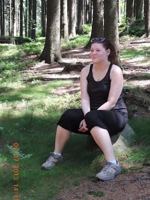

## Kdy a jak to začalo
Záchvatovité přejídání u mě začalo první rok na vysoké škole, když mi bylo 19 let. Na začátku to pro mě byla euforie - velké město, noví lidé a hlavně poprvé jsem vytáhla paty z domu. Cítila jsem se nezávislá a dospělá a plně jsem si to užívala. Projevilo se to i v jídle. Mohla jsem si koupit, co jsem chtěla. S nikým jsem se nemusela dělit. Snad poprvé v životě jsem byla v mekáči. Půlnoční kebab na cestě z hospody byl samozřejmost. Brzo jsem zjistila, že mě takové jídlo uspokojuje, a že při něm zapomínám na stres a problémy. Postupně jsem se na něj začala upínat čím dál tím víc, až se u mě rozvinulo záchvatovité přejídání. 



## Záchvatovité přejídání začne ovládat váš život
Záchvatovité přejídání je v podstatě závislost. Jídlo ovládá váš život a vy nemyslíte skoro na nic jiného. Já jsem se motala v začarovaném kruhu. Od pondělí jsem držela striktní dietu, jedla jsem málo, saláty, nízkotučné výrobky. Šla jsem běhat, moc jsem neuběhla, ale totálně jsem se zničila. V úterý už jsem ztrácela motivaci a ve středu jsem snědla první čokoládu. Zbytek týdne jsem v podstatě projedla s vrcholem v pátek nebo o víkendu, kdy jsem byla na kolejích sama a naplánovala jsem si přejezení. Moje přejídací jídlo byl hrnec plný špaget s rozpuštěným sýrem a majonézou. S tím jsem si zalezla do postele, pustila k tomu seriál a byl to pro mě úplný výmaz hlavy. Myšlenky na jídlo byly nutkavé a nemohla jsem myslet téměř na nic jiného. Někdy jsem dokonce odmítla jít na akci s přáteli, protože jsem si naplánovala přejezení a už jsem si domů nesla nakoupenou tašku s jídlem. Vymluvila jsem se, že se musím učit a duchem už jsem byla u špaget. 

## Po jídle přijdou výčitky
Už když jsem na jídlo jenom myslela, strašně jsem se u toho styděla. Při nákupu jsem měla neustále paranoidní pocit, že všichni vidí, co nakupuju a hodnotí to. Celou cestu domů autobusem jsem nemyslela na nic jiného, než na tu tašku s jídlem. Doma jsem se skoro nemohla dočkat, až se špagety uvaří a pak jsem to do sebe naládovala. Rychle. Hltavě. Hlavně, aby mě u toho nikdo neviděl. Ta představa pro mě byla naprosto šílená. Po jídle mi bylo špatně nejenom fyzicky, ale i psychicky. Přišly výčitky, pocit nedostatečnosti, selhání, zhnusení ze sebe sama, ujišťování se, že to bylo naposled a že už to příště neudělám. Že od pondělka začnu jíst zase zdravě a bude to dobrý. Nebylo.

## Proč se to u mě rozvinulo
Myslím, že důvodů, proč jsem začala trpět záchvatovitým přejídáním u mě bylo vícero. Zaprvé jsem tou dobou byla nešťastně zamilovaná a cítila jsem se odmítnutá a sama. Zadruhé jsem začala studovat poměrně těžkou školu a hned první semestr jsem dvakrát vyletěla od první zkoušky, což mě vrátilo nohama zpátky na zem. Zároveň bylo ve škole poměrně konkurenční prostředí. Neustále jsme se porovnávali, kdo se kdy co učil, jak dlouho se učil, kolik už má kdo projitých otázek ke zkoušce. A nešlo jen o vědomosti. Ve škole byla skupina holek, které neustále řešily vzhled, velikost kalhot, že nesnědí celou pizzu na oběd a že maximálně jeden trojúhelník, jestli si nedáme jednu pizzu na oběd společně (v mojí hlavě vždycky znělo - proboha, každej chce přece sníst celou pizzu, já chci sníst celou pizzu!). Ale vždycky jsem souhlasila. Za tyhle myšlenky jsem se styděla. A zatřetí, moje celoživotní strategie přežití bylo popírání. Jakmile jsem cítila nepříjemnou emoci nebo měla problém, nejjednodušší bylo to popřít. V rozpoznávání emocí jsem tou dobou byla naprosté pako. Jídlo mi ideálně zapadalo do tohoto životního kontextu. Přejídání nebylo nic jiného než popírání. 

> Jenže popírání nikdy nic nevyřeší. Je to jenom zametání problémů pod koberec, kde hnijou a hnijou a jednou se na vás stejně vyvalí. 

## Přibrala jsem skoro 20 kilo
Víc jsem jedla, méně se hýbala, a tak jsem zcela přirozeně začala přibírat. Nejvíc jsem vážila o 20 kilo víc, než nyní a nabrala jsem je v poměrně krátkém čase, takže to byla znatelná změna. Víc kilo jenom zvyšovalo pocit frustrace a znechucení ze sebe sama, což vedlo jen k dalšímu přejídání. Byl to začarovaný kruh. 

| rok 2013 | rok 2022 |
| -------  | -------- |
|  |  |

## Základ je se svěřit
V tu dobu jsem si našla přítele. Jak jsme spolu začali chodit, přejídání se výrazně zlepšilo. Neměla jsem na to čas ani myšlenky, ze školy jsem lítala na rande, pak zase škola a navíc jsem chtěla vypadat co nejlíp. Kila šla dolů v podstatě sama. To mě ještě víc nakoplo a začala jsem i trochu pravidelně sportovat. Jenže počáteční zamilovanost vyprchala, vztah nebyl funkční a já jsem se postupně k přejídání vrátila. Tehdy už mi bylo jasné, že je to problém a že to musím začít řešit, jinak to dopadne hůř než předtím. Bývalý přítel byl první člověk, kterému jsem o tom řekla. Tímto mu chci veřejně poděkovat, protože mě neodsoudil, podpořil a popíchl mě k tomu, abych vyhledala psychoterapii. O té jsem už předtím uvažovala, ale nikdy jsem se neodhodlala na ní jít. 

## Psychoterapie vám pomůže rozklíčovat pravý problém
Rozhodnutí jít na psychoterapii považuji za jedno z nejlepších v mém životě. Přišla jsem tam s tím, že mám problém se záchvatovitým přejídáním. Po půl roce terapie jsem zjistila, že nemám problém s přejídáním, ale že je to pouze moje naučené řešení jiných problémů schovaných pod povrchem, které jsem do té doby nevnímala. Začala jsem se víc orientovat ve svých emocích, uvědomila jsem si, že mám malé sebevědomí i pocit sebehodnoty a že si nedokážu postavit svoje hranice. Jakmile jsem se začala soustředit na tyto svoje aspekty, problémy s jídlem začaly samovolně odeznívat. Dysfunkční vztah jsem ukončila a začala jsem se stavět na vlastní nohy. 

> Záchvatovité přejídání není hlavní problém. Je to řešení problémů, které se skrývají hlouběji pod povrchem.

## Jak to mám nyní
Momentálně nemám s přejídáním aktivní problém, ale stále jsem stresový jedlík. Když je mi smutno, jsem deprimovaná nebo frustrovaná, mám tendenci to řešit jídlem. A někdy se přejím. A je to naprosto v pořádku. Jsem jenom člověk. Ale je důležité si to uvědomit, řešit ten základní problém a být k sobě shovívavý. Když se cítím na mateřské osamnělá, tak si zorganizuju sociální akci. Když mám pocit, že toho máme hodně a pořád někde lítáme, zařídím následující dny volno, abychom mohli zklidnit. Pracuji na tom, abych si vybudovala nový návyk a místo jídla šla třeba cvičit nebo se ven projít. Už nemám pocit, že by o mém životě rozhodovalo pouze jídlo.

> První krok je si uvědomit, že je to problém. Druhý krok je se s ním svěřit. Pak můžete začít rozklíčovávat, jaký problém tím zakrýváte. 

Mějte se rádi a buďte k sobě upřímní.

Vaše A.

